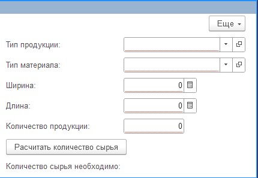
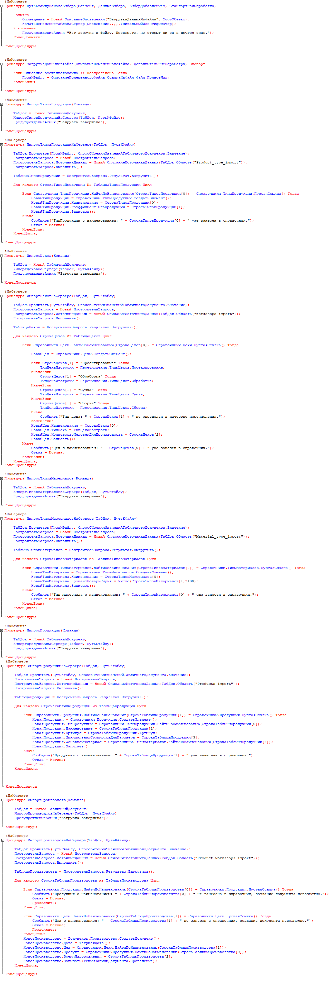
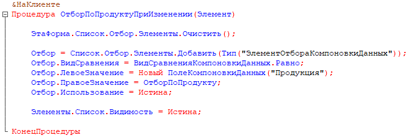
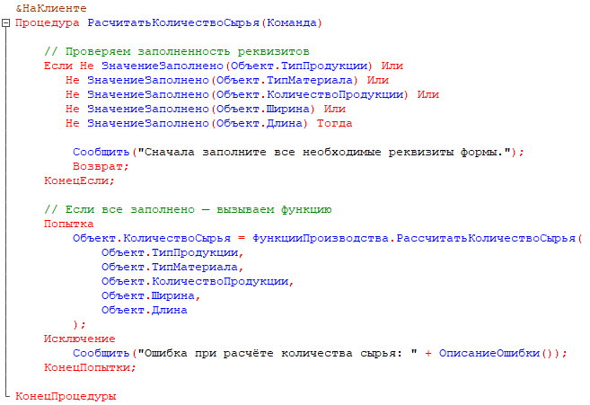
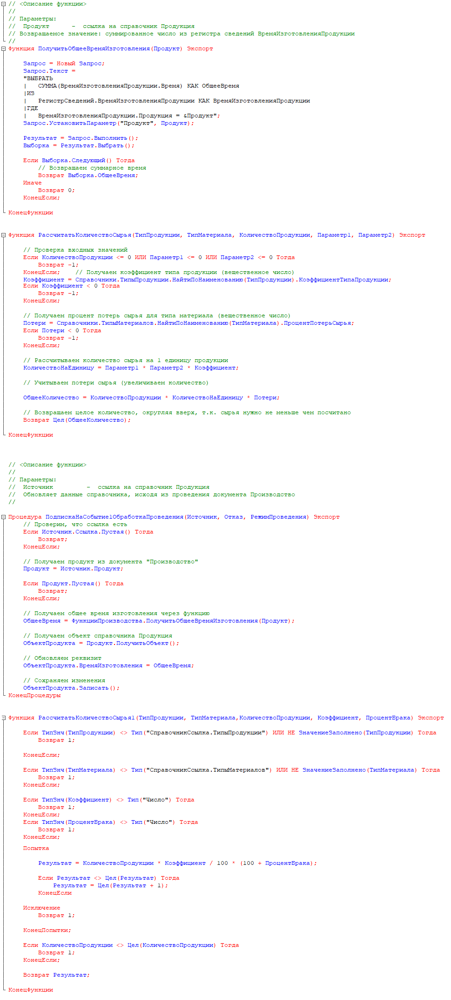

# 📊 Обработка: Выгрузка из Excel, отбор по цехам и расчет материалов

Данная обработка предназначена для автоматизации импорта данных из Excel, отбора по списку цехов и расчета количества необходимых материалов.  
Реализована логика обработки Excel-файлов, выборочного анализа по подразделениям и вычисления материальных потребностей через общий модуль.  

---

## ⚙️ Основной функционал

- 📥 **Импорт данных из Excel** с помощью встроенных средств 1С  
- 🏭 **Отбор данных по списку цехов** (с возможностью фильтрации и редактирования)  
- 📐 **Расчет количества материалов** по данным цехов  
- ⚡ Использование **общего модуля** с отдельной функцией расчета  
- 🖨 Возможность выгрузки результатов и последующей обработки данных  

---

## 🗂 Структура обработки

**Формы обработки:**
- `ИмпортИзExcel` — загрузка и предварительный просмотр данных  
- `ПолучитьСписокЦехов` — выбор цехов для дальнейшего анализа  
- `РасчетМатериалов` — расчет потребности в материалах с вызовом общей функции  

**Общий модуль:**
- `ФункцииПроизводства` — содержит функцию вычисления количества материалов на основе входных данных  

---

## 🖼 Скриншоты

**Формы обработки:**

-   
-   
-   

---

## 📄 Листинги кода

-   
-   
-   
-   

---

## 🧩 Технические детали

- Платформа: **1С:Предприятие 8.3**  
- Тип: **тестовая конфигурация**  
- Версия: **1.0**  
- Архитектура: управляемые формы + общий модуль  
- Язык: встроенный язык 1С  
- Интерфейс: управляемый, поддерживает взаимодействие с Excel  
- Особенности:
  - Обработка импорта из Excel
  - Расчет материалов выполняется в обработке через функцию общего модуля
  - Отбор по цеху при помощи обработки 

---

## 🧠 Пример бизнес-логики

При загрузке Excel-файла обработка:
1. Считывает таблицу данных.  
2. Отбирает строки, относящиеся к выбранным цехам.  
3. Передает эти данные в общий модуль.  
4. Общий модуль рассчитывает количество материалов по заданным коэффициентам.  

---

## 💾 Архив конфигурации
- [data_processors_excel_sorting_calculation.dt](https://drive.google.com/file/d/16F_IkIucREoaXmZCfJkEQdmeuq2YySAv/view?usp=drive_link) — резервная копия базы 

---

## 🔗 Автор
**Ермолаев Глеб**  
GitHub: [TheFlukas](https://github.com/TheFlukas)

---