# 🏭 Производство дверей

Эта конфигурация была разработана для олимпиады и автоматизирует процессы производства и продажи дверей. Она включает управление заказами клиентов, планирование производства, учет движения денежных средств и регистры для контроля остатков товаров.  

---

## ⚙️ Основной функционал

- Управление заказами покупателей (создание, редактирование, печать)
- Планирование и производство дверей
- Учёт оплаты и реализация продукции
- Автоматизация печати документов
- Контроль остатков товаров и материалов
- Отчеты по заказам, производству и продажам  

---

## 🗂 Основные объекты конфигурации

**Справочники:**
- Клиенты
- Товары
- Статьи движения денежных средств

**Документы:**
- ЗаказПокупателя
- Оплата
- ПланПроизводства
- Производство
- Реализация

**Перечисления:**
- СтатусыЗаказов
- ВидыОплаты
- ТипыДенежныхСредств

**Отчеты:**
- ВедомостьЗаказовПокупателей
- Производство

**Регистры:**
- РегистрСведений.ЦеныТоваров
- РегистрНакопления.ДвиженияДенежныхСредств
- РегистрНакопления.Заказы

---

## 🖼 Скриншоты

**Документы:**
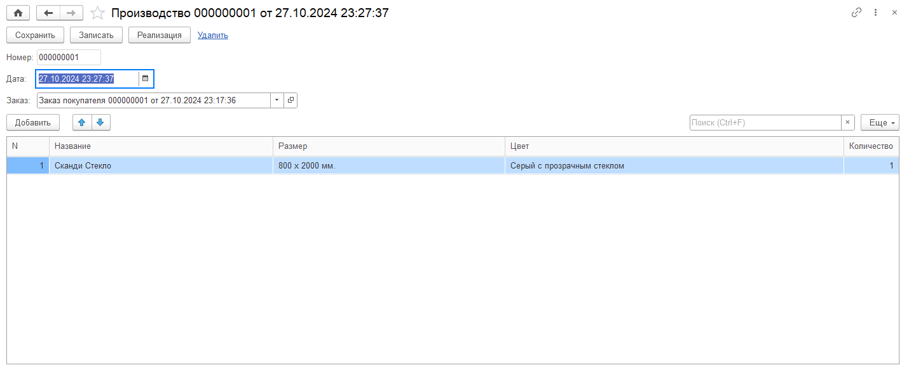  
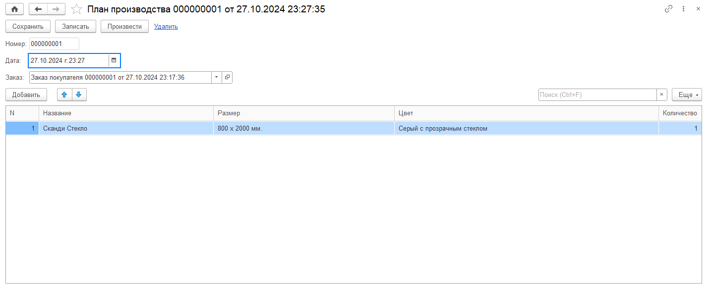  
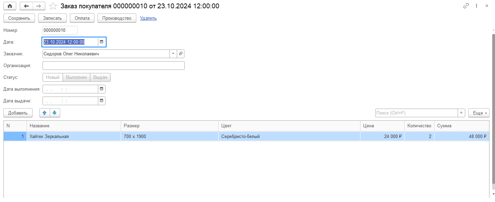  
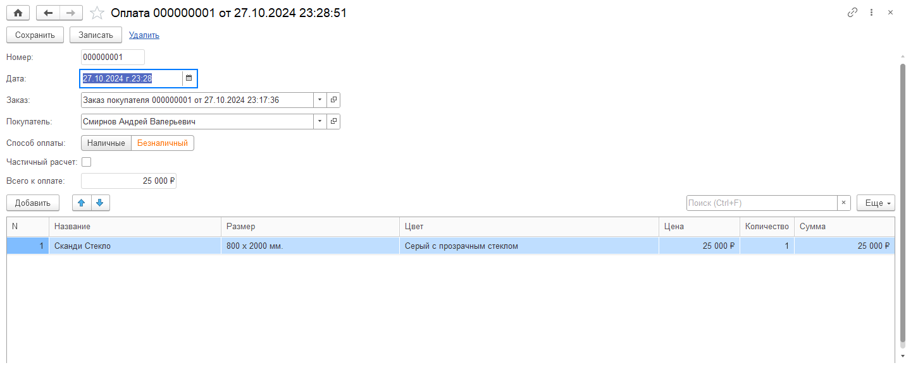  
  

---

## 📄 Листинги кода

- 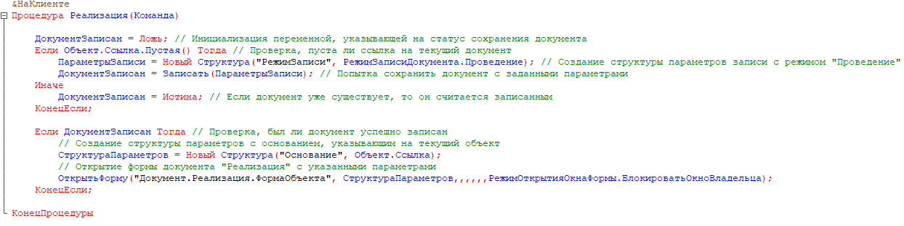  
- 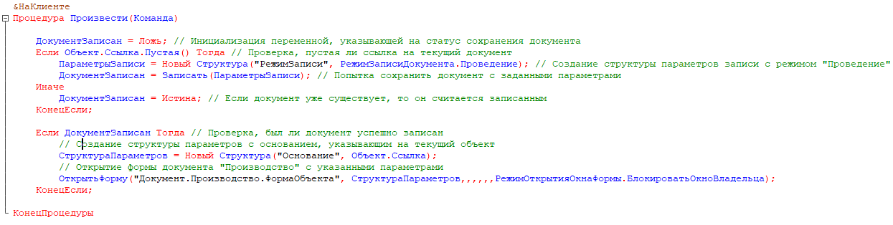  
- 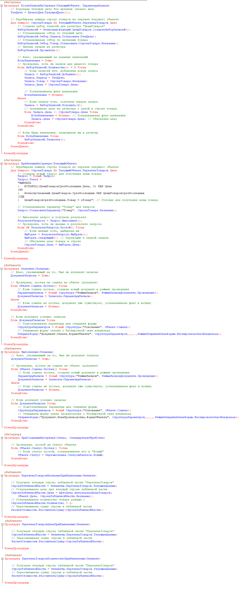  
- 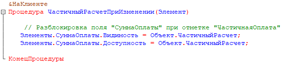  
- 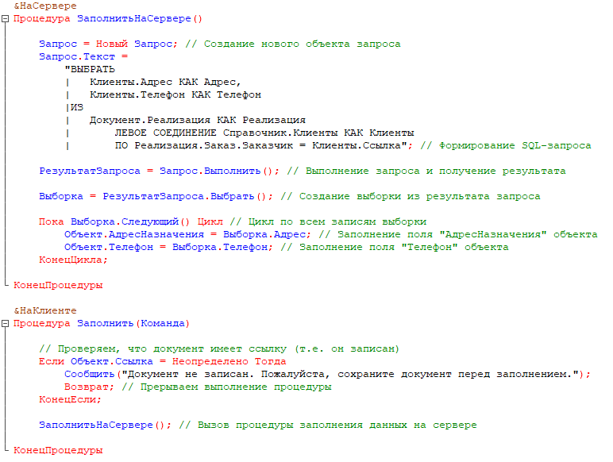  
- 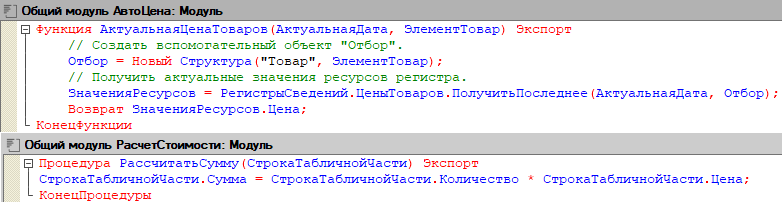  

---

## 📊 Схема базы данных

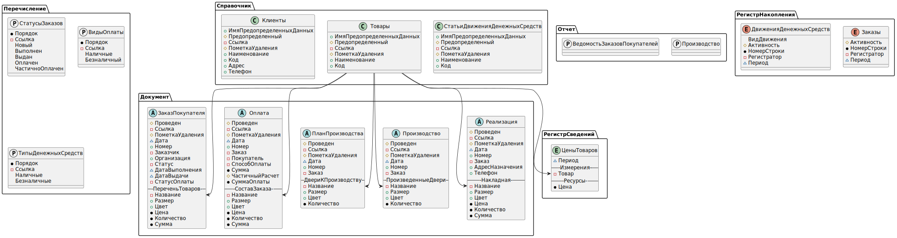  

---

## 🧩 Технические детали

- Платформа: **1С:Предприятие 8.3**  
- Тип: **самописная конфигурация**  
- Версия: **1.0**  
- Архитектура: документы + справочники + регистры накопления + регистры сведений + управляемые формы  
- Язык: встроенный язык 1С  
- Интерфейс: управляемый, поддерживает обработку заказов, планирование производства, оплату и реализацию  
- Особенности: автоматизация производства дверей для олимпиады, управление заказами, планирование производства и контроля остатков, расчёт стоимости и печать документов  

---

## 💾 Архив конфигурации
- [doors_factory1.0.dt](https://drive.google.com/file/d/1kIznIprndelVph9PQiypPvxPcmlNQzb6/view?usp=drive_link) — резервная копия базы  

---

## 🔗 Автор
**Ермолаев Глеб**  
GitHub: [TheFlukas](https://github.com/TheFlukas)

---
