# 🧩 ТестовоеРасширение

**Подсистема расширения:** `ИТ_Расширение`  
**Платформа:** 1С:Предприятие 8.5  
**Тип проекта:** Расширение типовой конфигурации (Управление торговлей 11.5.17.219)

---

## 📖 Описание

Расширение добавляет новый функционал для работы с документом **Пояснительная записка**, дорабатывает справочник **Номенклатура** и реализует отчёт с автоматической рассылкой.  

Все изменения выполнены **через расширение**, без изменения типовой конфигурации.  

---

## 🚀 Реализованные объекты

### 1. 📄 Документ: **Пояснительная записка**
- Возможность создания на основании документа **Заказ клиента**  
- Реквизит для произвольного **форматированного текста**  
- Поддержка **вставки изображений** и **прикрепления файлов**  
- Просмотр связанных документов  
- Печатная форма (дата, номер, текст пояснения)

---

### 2. 📁 Справочник: **ИТ_ПояснительнаяЗапискаПрисоединенныеФайлы**
- Используется для хранения файлов, прикреплённых к документу *Пояснительная записка*

---

### 3. 📦 Справочник: **Номенклатура**
- Добавлен реквизит **Сезон** *(Лето, Зима, пусто)*  
- В форму элемента добавлен реквизит **Сезон**  
- Обработка **ИТ_ЗаполнениеСезона** — случайное заполнение значений, с возможностью очистки

---

### 4. 🔢 Перечисление: **ИТ_Сезон**
- Значения:  
  - `Лето`  
  - `Зима`

---

### 5. 📊 Отчет: **ИТ_ПояснительныеЗапискиЗаДень**
- Отображает документы *Пояснительная записка* за текущий день  
- Настроена **рассылка отчёта по будням (кроме выходных)** всем пользователям  
- Использует стандартный механизм **“Рассылка отчетов”** из 1С:УТ

---

### 6. ⚙ Общие модули и подписки
- Изменён общий модуль **СтруктураПодчиненностиСлужебный**  
  → добавлена поддержка связанных документов  
- Подписка на событие **ОпределитьФормуПрисоединенногоФайлаВзаимодействия**  
  → для корректной работы с файлами пояснительной записки  
- Общая команда **ИТ_СоздатьНаОсновании**  
  → отображает действие “Создать Пояснительную записку” из документа *Заказ клиента*

---

### 7. 🧱 Типовые объекты подсистемы
- Используется стандартная подсистема **ДополнительныеОтчетыИОбработки**
- Добавлен критерий отбора **ИТ_СвязанныеДокументы**
- Изменены определяемые типы:
  - `ПрисоединенныйФайл`
  - `ПрисоединенныйФайлОбъект`
  - `ВладелецПрисоединенныхФайлов`
  - `ВладелецПрисоединенныхФайловОбъект`
- Изменены процедуры типовой формы **СвязанныеДокументы**:
  - `ИТ_ОбъектыПоКритериюОтбора`
  - `ИТ_ВывестиРодительскиеОбъекты`
- На форме документа *Пояснительная записка* добавлены реквизиты для работы с файлами и текстом

---

## 🧭 Инструкция по использованию

### 1. Создание документа **Пояснительная записка**
1. Открой документ **Заказ клиента**
2. Через команду *Создать на основании* выбери **Пояснительная записка**
3. Введи текст, вставь изображения или прикрепи файлы
4. Можно распечатать документ и просмотреть связанные объекты

---

### 2. Заполнение реквизита **Сезон** в номенклатуре
1. Открой обработку **ИТ_ЗаполнениеСезона**
2. Нажми кнопку “Заполнить случайно” или “Очистить значения”
3. Сезон будет установлен для элементов справочника *Номенклатура*

---

### 3. Формирование отчета **Пояснительные записки за день**
- Отчет формируется стандартным механизмом 1С  
- Рассылка выполняется автоматически по **будням** всем пользователям  
- Можно просмотреть историю рассылок через меню **“Рассылка отчетов”**

---

## 🧩 Технические детали

- Платформа: **1С:Предприятие 8.3**
- Конфигурация: **Управление торговлей 11**
- Тип решения: **Расширение**
- Подсистема: **ИТ_Расширение**
- Используемые типовые механизмы:
  - *ДополнительныеОтчетыИОбработки*
  - *Рассылка отчетов*
  - *Связанные документы*

---

## 🖼 Скриншоты

- 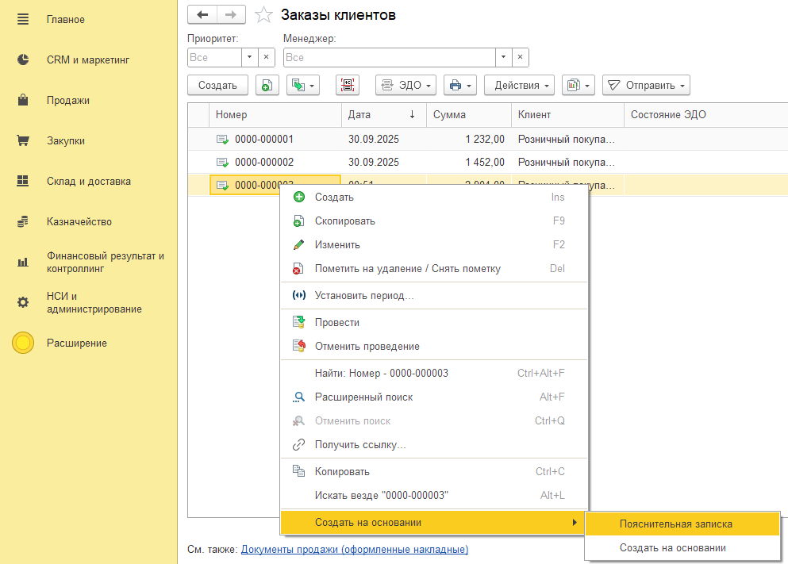  
- 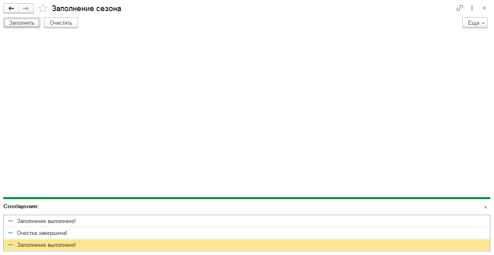  
-   
- 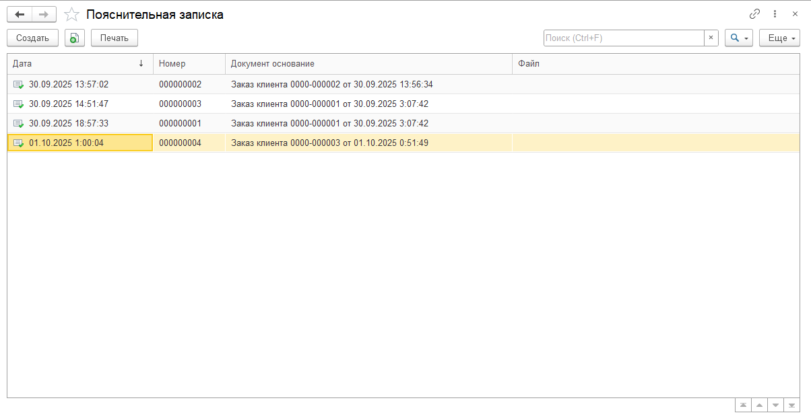  
- 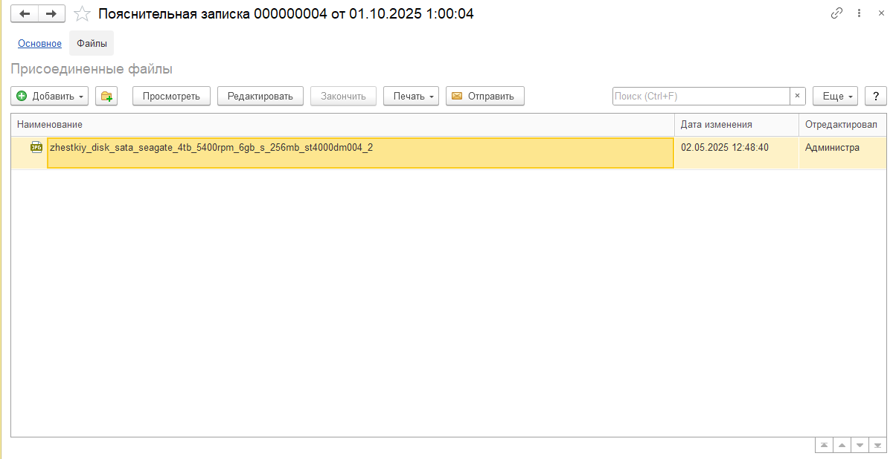  
- 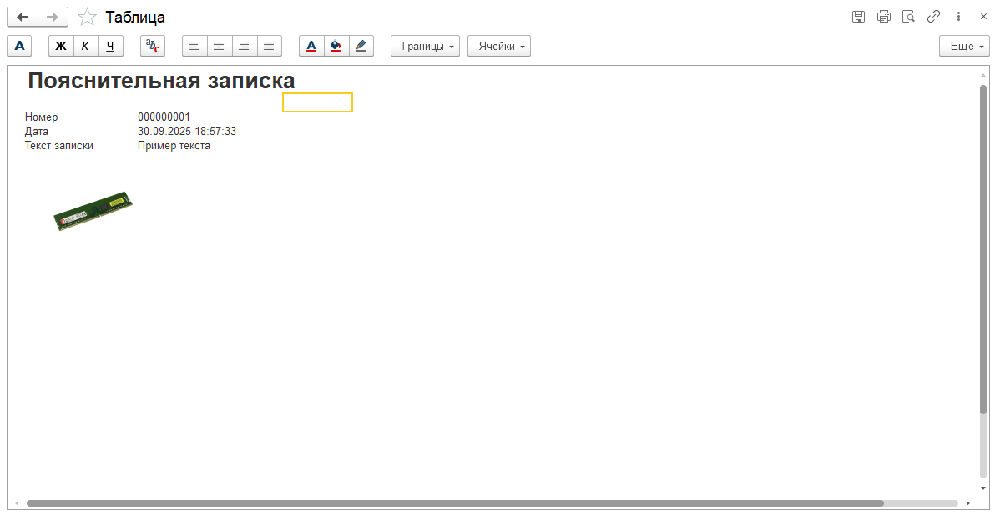  
- 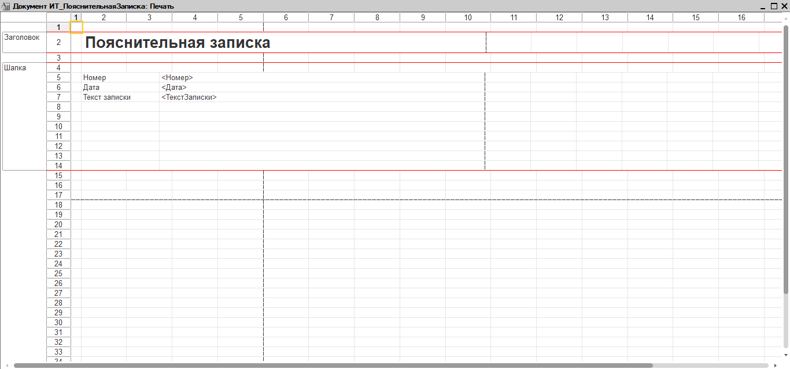  
- 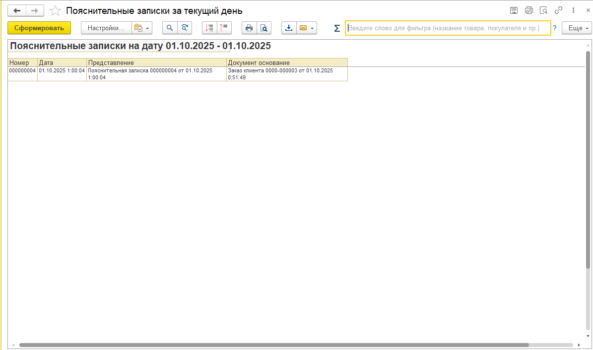  
- 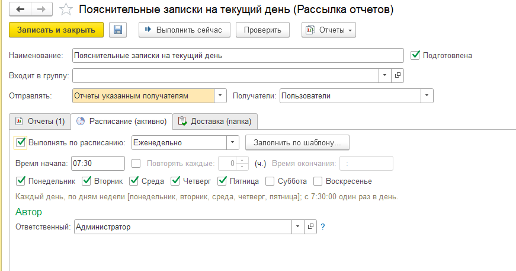  
- 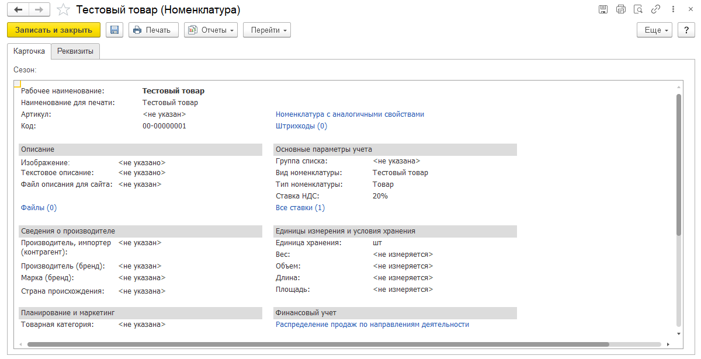  
-   

---

## 📄 Листинги кода

- 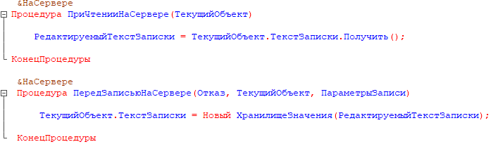  
- 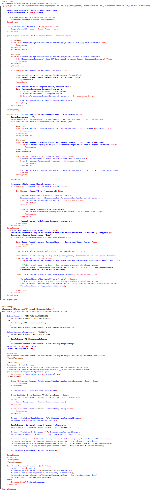  
- 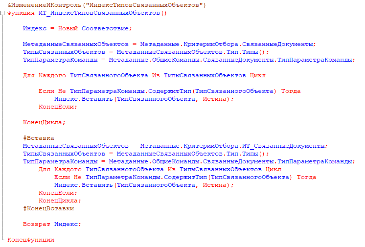  

---

## 🧾 Примечания

- Все доработки выполнены в **расширении**, без изменения типовой конфигурации  
- Расширение включает подсистему **ИТ_Расширение**  
- Для связей документов используется **расширение стандартной логики** через дополнительные процедуры в общих модулях  
- Код оформлен в соответствии со стандартами 1С и максимально совместим с обновлениями типовой конфигурации  

---

## 🏁 Результат

Расширение демонстрирует:
- Владение механизмом **расширений конфигураций**
- Использование **типовых подсистем и механизмов УТ**
- Работа с **файлами, форматированным текстом, рассылками и связанными документами**
- Чистую и безопасную интеграцию без изменения типовой базы

---

## 💾 Архив конфигурации
- [ТестовоеРасширение.cfe](archive_base/Test_extension.cfe)
- [ИТ_ПояснительныеЗапискиЗаДень.erf](IT_Explanatory_notes_for_one_day.erf)
- [УТ11.5.17.219.dt](https://drive.google.com/file/d/1MLI87riPJ5bqdPQMnUKnqdRMt6LB2PPN/view?usp=drive_link) — резервная копия базы.

---

## 🔗 Автор
**Ермолаев Глеб**  
GitHub: [TheFlukas](https://github.com/TheFlukas)

---