# 💻 Автоматизация процессов IT-сервиса

Данная конфигурация предназначена для автоматизации деятельности IT-сервиса, включая управление заявками, учет услуг, контроль складских остатков, расчёт заработной платы, взаимодействие с партнёрами и интеграцию с Telegram через библиотеку подсистем.

Проект разрабатывался с использованием **1С:Предприятие 8.3**, реализует полный цикл обслуживания клиентов — от регистрации заявки до выставления счёта и контроля оплат.

---

## 🚀 Основные возможности

- 🧾 **Управление заявками и инцидентами**
  - Регистрация заявок клиентов и внутренних обращений
  - Автоматическое создание инцидентов и связанных документов
  - Классификация по видам услуг, ответственным и статусам

- 🧰 **Учёт услуг и активов**
  - Каталог IT-услуг, оборудования, партнёров и сотрудников
  - Контроль остатков на складах и движение номенклатуры
  - Автоматическое обновление цен через регистр сведений

- 💵 **Финансовый учёт**
  - Счета, оплаты и расчёты с контрагентами
  - Расчёт заработной платы с печатными формами
  - Контроль дебиторской задолженности и отчёт о движении денежных средств

- 🧮 **Отчётность и аналитика**
  - Отчёты по заказам, услугам, сотрудникам, движениям запасов
  - Прогнозирование остатков и анализ выручки по периодам
  - Дашборд с ключевыми показателями деятельности сервиса

- 🤖 **Интеграция с Telegram**
  - Отправка уведомлений и создание заявок через бот
  - Использование **Subsystems Library** для взаимодействия

---

## 🗂 Структура конфигурации

- **Документы:**  
  `Заявка`, `Инцидент`, `Счёт`, `Платёж`, `Партнёрский заказ`, `Выдача услуги`, `Начисление зарплаты`  
- **Справочники:**  
  `Услуги`, `Сотрудники`, `Должности`, `Контрагенты`, `Склады`, `Активы`, `Авторизованные лица`  
- **Регистры:**  
  - Накопления: движение и остатки товаров, заказы, выручка  
  - Сведения: цены номенклатуры, статусы заказов, параметры расчётов  
- **Отчёты:**  
  - `Отчёт по заказам`, `Отчёт по сотрудникам`, `Отчёт по услугам`,  
    `Прогноз остатков`, `Движение запасов`, `Отчёт о движении ДС`  
- **Подсистемы:**  
  Управление заказами, учёт услуг, склад, финансы, аналитика, Telegram-интеграция  

---

## 🧩 Технические детали

- Платформа: **1С:Предприятие 8.3**
- Тип: **самописная конфигурация**
- Версия: **1.0.1.1**
- Архитектура: документы + справочники + регистры + управляемые формы
- Язык: встроенный язык 1С
- Интерфейс: управляемый, поддерживает обработку и печать
- Использует: **Библиотеку стандартных подсистем (БСП 3.1.7.165)**
- Интеграции: Telegram API (через БСП)
- Реализованы механизмы:
  - Контроль остатков при проведении документов
  - Автоматическая установка цен и расчёт длительности услуг

---

## 🧠 Пример бизнес-процесса

1. Клиент оформляет заявку на услугу.  
2. Система создаёт **инцидент** и формирует **заказ**.  
3. При выполнении заказа формируется **акт оказания услуги**.  
4. Создаются документы **счёт** и **платёж**, выполняется контроль остатков.  
5. Сотрудникам начисляется **заработная плата** на основании выполненных заказов.  
6. Информация передаётся в **Telegram** для уведомлений и контроля.

---

## 🖼 Скриншоты интерфейса

- 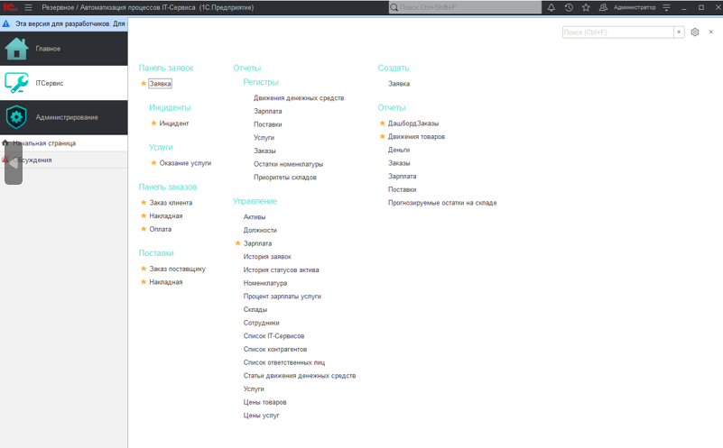  
-   
- 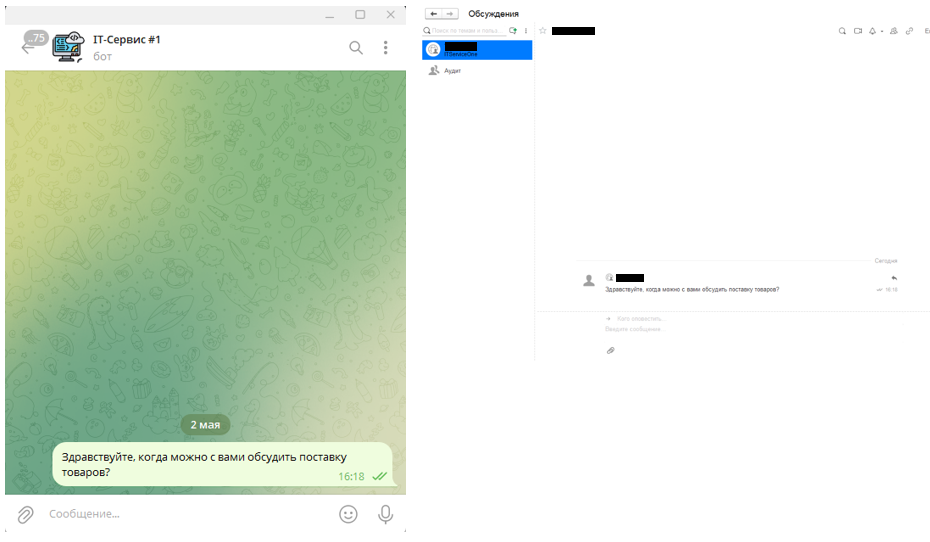  
- 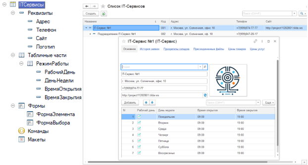  
- 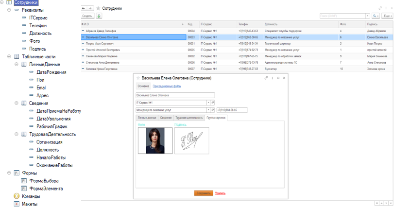  
-   
- 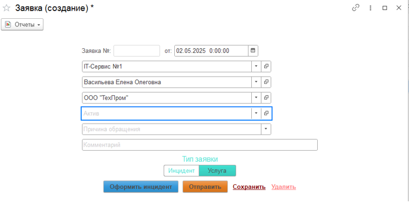  
- 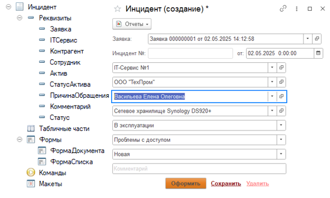  
- 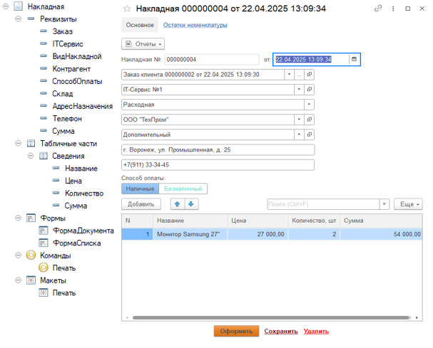  
- 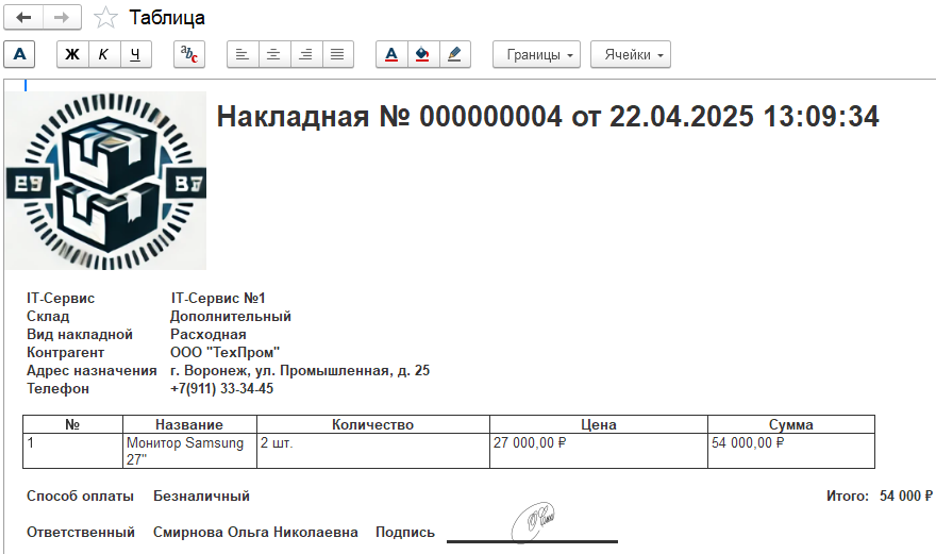  
- 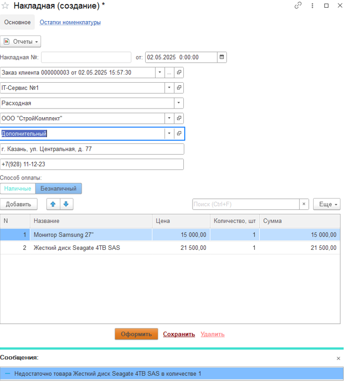  
- 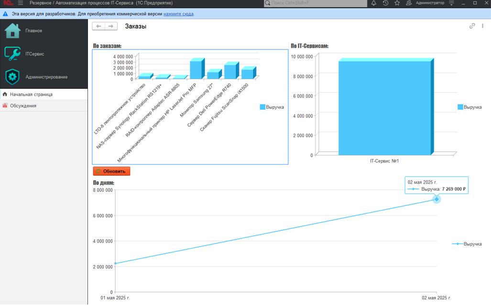  
- 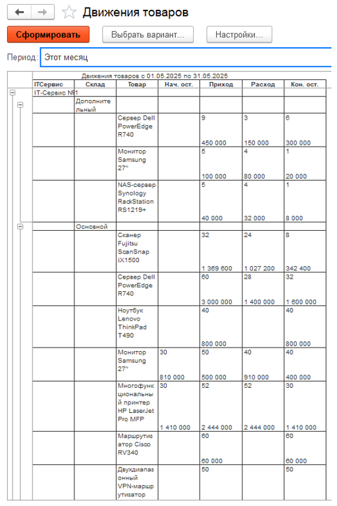  
- 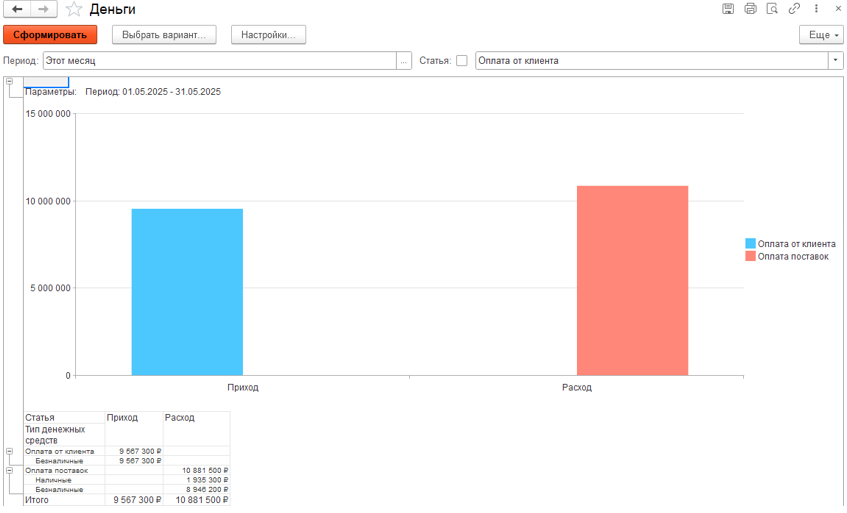  

---

## 📄 Листинги кода

- 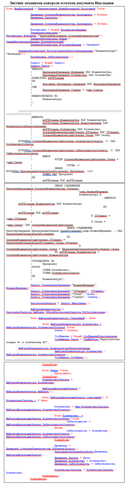  
- 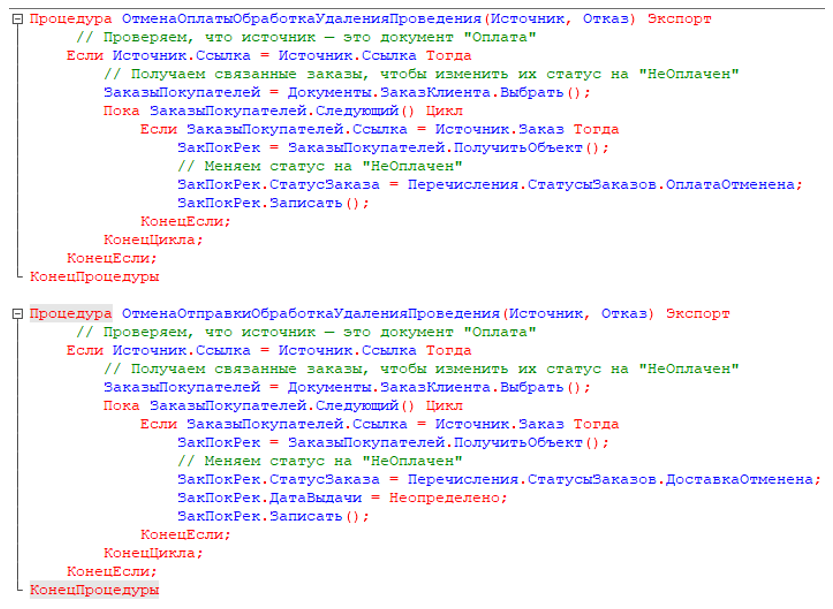  
- 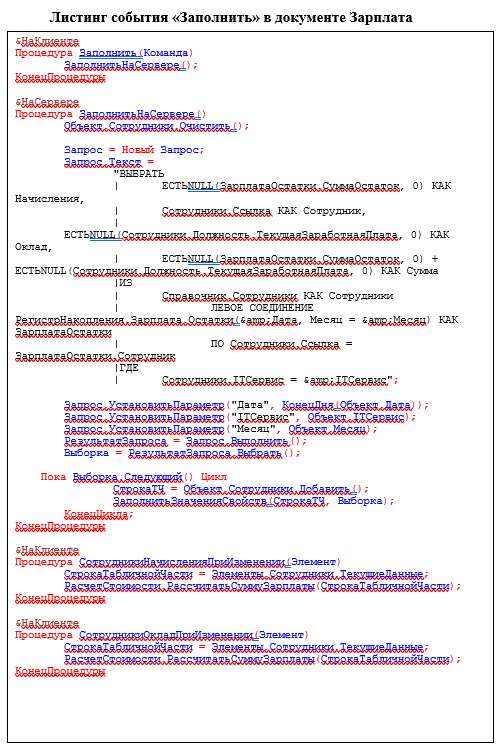  
- 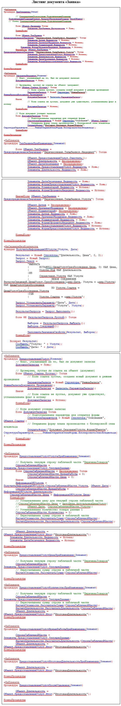  
- 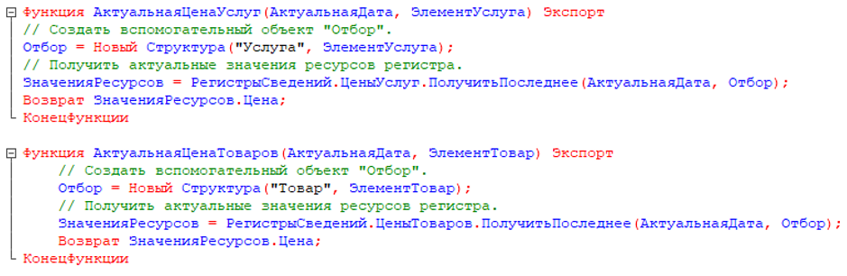  
- 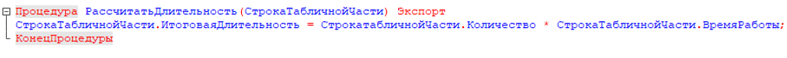  
- 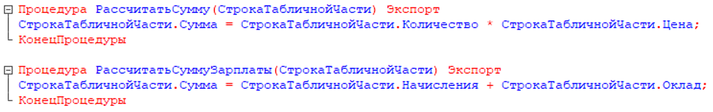  

---

## 🧾 Документация

- [📘 Техническое задание (Specifications.docx)](docs/Specifications.docx)  
- [🗺 Схема процессов IT-сервиса 1](docs/IT_service_process_automation1.svg)  
- [🗺 Схема процессов IT-сервиса 2](docs/IT_service_process_automation2.svg)  

---

## 📦 Архив базы

- [Файл конфигурации и базы itspa1.0.1.1.dt](https://drive.google.com/file/d/17GCRqYtWXgfLXAikRSPFQibNDeqRwwO5/view?usp=drive_link)

---

## 🧰 Используемые технологии

| Компонент | Назначение |
|------------|------------|
| **1С:Предприятие 8.3** | Разработка и запуск приложения |
| **БСП 3.1.7.165** | Унифицированные подсистемы (пользователи, обмен, файлы) |
| **Telegram Bot API** | Уведомления и взаимодействие с клиентами |
| **Управляемые формы** | Удобство использования, дополнительная функциональность и адаптивность |
| **Регистры сведений и накопления** | Учёт остатков и истории заказов |

---

## 🔍 Ключевые особенности

- Полноценный цикл обслуживания клиента: от заявки до расчёта и отчётности  
- Удобный управляемый интерфейс с подсистемами  
- Telegram-интеграция для оперативного контроля заявок  
- Расширенные отчёты и аналитика  

---

## 🏁 Результат

Проект обеспечивает прозрачный и автоматизированный контроль над процессами IT-сервиса, сокращает время обработки заявок и повышает эффективность управления услугами, складом и финансами.

---

## 🔗 Автор
**Ермолаев Глеб**  
GitHub: [TheFlukas](https://github.com/TheFlukas)

---

