# 🥩 Конфигурация "Мясокомбинат"

## 📖 Описание проекта
Автоматизация производственных и торговых процессов мясокомбината: от поступления сырья и содержания животных до выпуска готовой продукции и учета продаж.  

Конфигурация демонстрирует навыки работы с 1С:Предприятие 8.3:
- Создание справочников и документов
- Работа с регистрами накопления и сведений
- Управление производственными процессами и зарплатой сотрудников
- Настройка отчетов и дашбордов

---

## ⚙️ Основной функционал

### 📦 Справочники
- Животные, Сырье, Продукция
- Склад, Контрагенты, Сотрудники
- Ответственные лица, Должности
- Статьи движения денежных средств

### 📄 Документы
- Приходная накладная (сырье, животные)
- Производство продукции и сырья
- Отгрузка продукции
- Учет рабочего времени
- Расчет зарплаты

### 📊 Регистры
- **Сведения:** Цена, История отгрузок
- **Накопления:** Зарплаты, Остатки сырья, Остатки продукции, Отгрузки, Движения денежных средств, Рабочее время, Остатки животных

### 🔗 Связи объектов
- Сырье → Продукция::Сырье  
- Животные → ПриходнаяНакладная::Название  
- Продукция → ПроизводствоПродукции::Продукт  
- Сотрудники → ПроизводствоПродукции::Сотрудник  
- Продукция → ОтгрузкаПродукции::Продукт  
- Сотрудники → УчетРабочегоВремени::Сотрудник  
- Сотрудники → РасчетЗарплаты::Сотрудник  
- Склад, Контрагенты, Виды накладной → соответствующие регистры  

*(подробная схема в разделе документации)*

---

## 🖼️ Скриншоты интерфейса

| Главное меню | Справочник продукции | Приходная накладная |
|---------------|-------------------|-------------------|
| 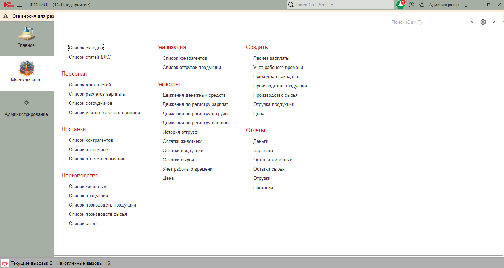 | 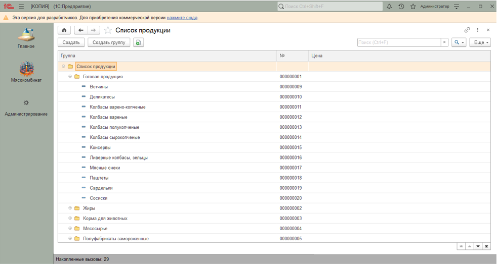 | 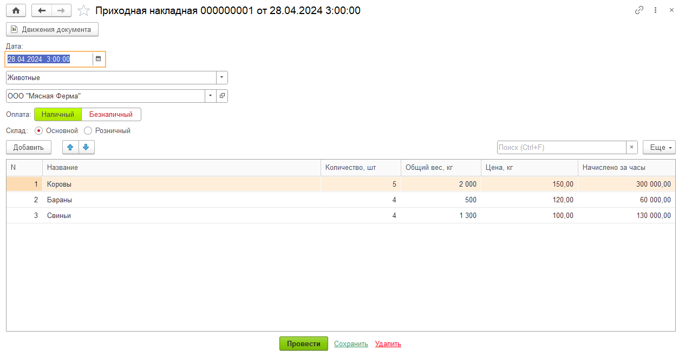 |

| Печать приходной накладной | Производство материалов | Печать производства материалов |
|----------------------------|----------------------|-------------------------------|
| 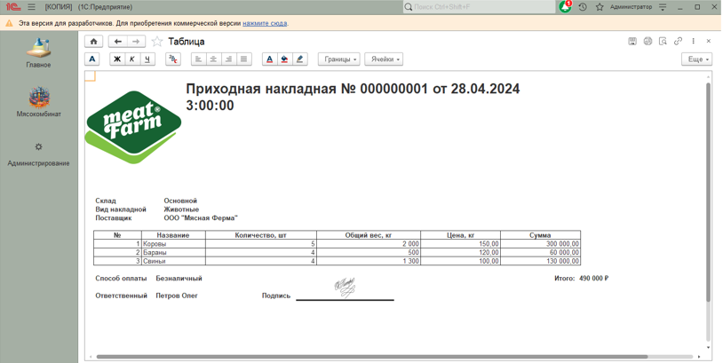 | 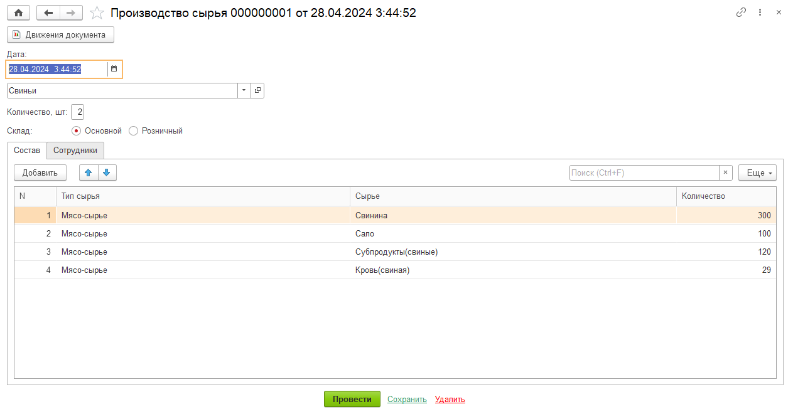 | 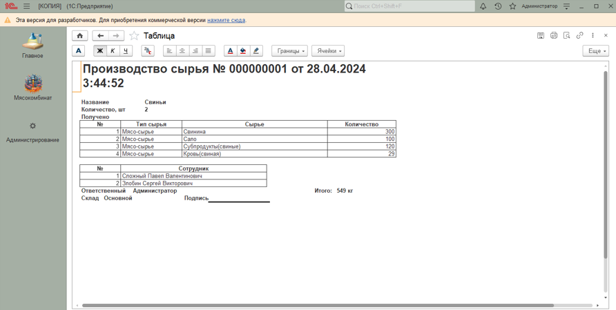 |

| Производство продукции | Печать продукции | Отгрузка продукции |
|------------------------|-----------------|-----------------|
| 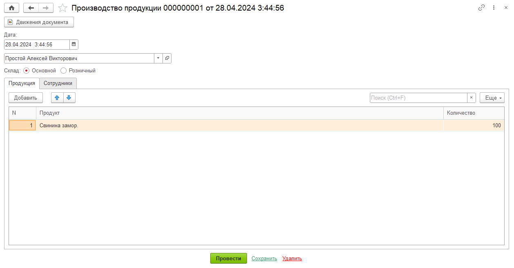 | 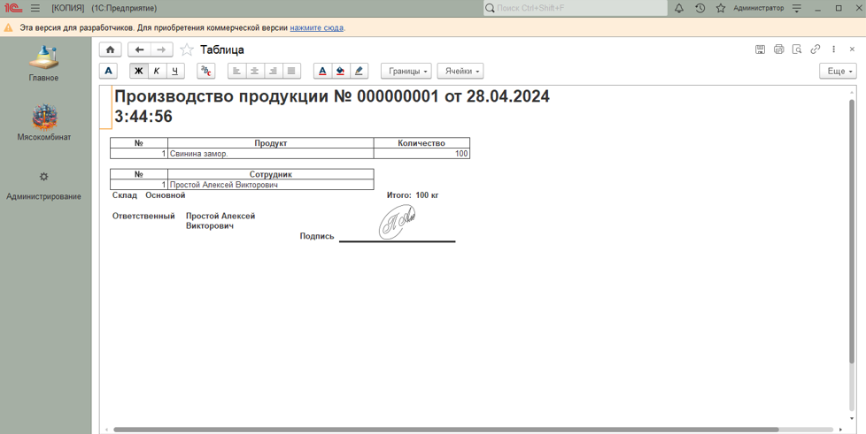 | 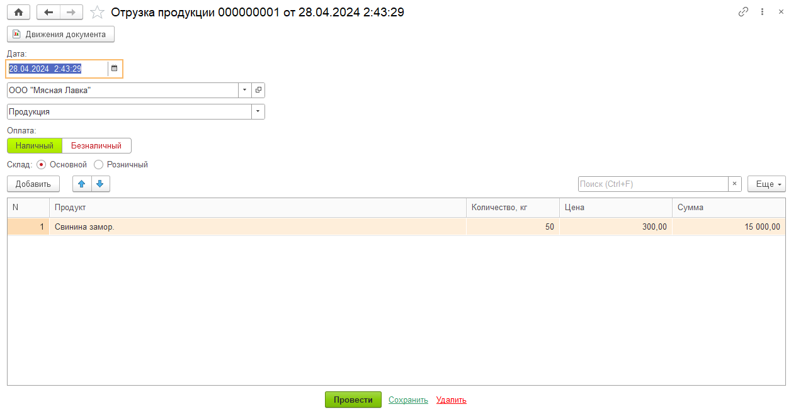 |

| Печать отгрузки | Дашборд продаж | Загрузка |
|----------------|----------------|---------|
|  | 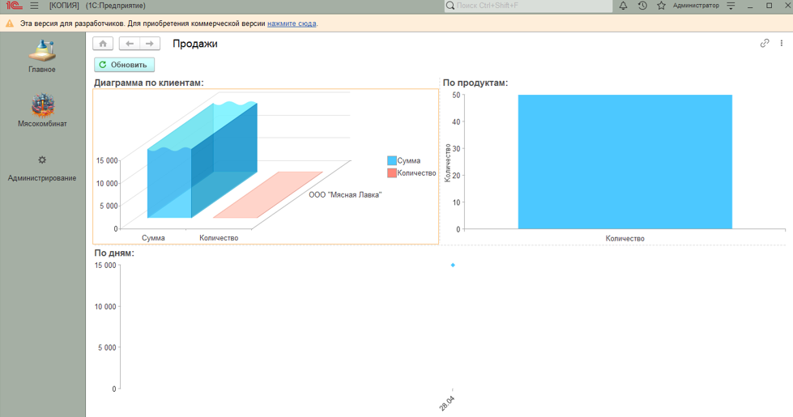 | 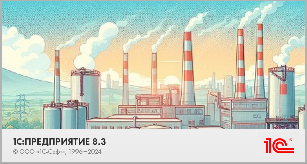 |

---

## 🧩 Код и листинги
*(если будут листинги, их можно добавить сюда аналогично ресторану)*

---

## 📚 Документация
ER-схема базы:  
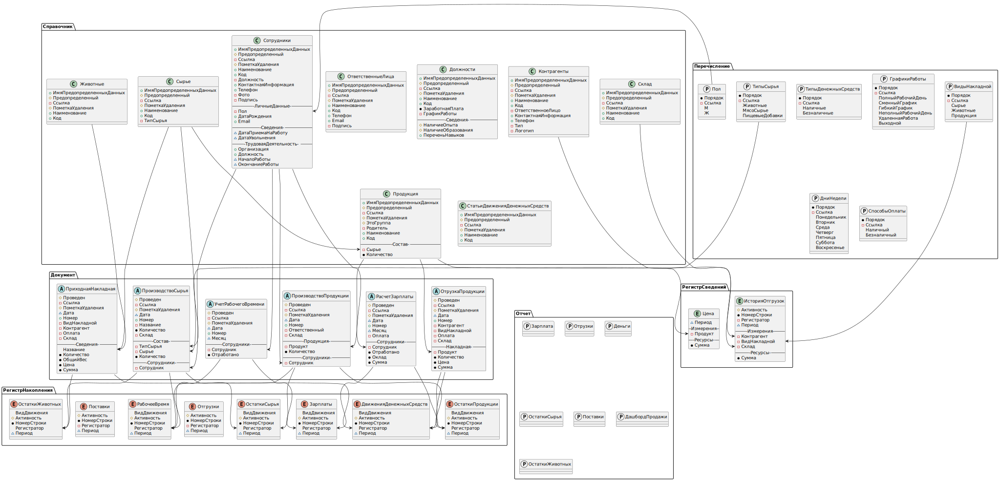

---

## 💾 Архив конфигурации
- [meat-plant.dt](https://drive.google.com/file/d/1kRaQfTXUGJ8fQOSLyVyhe2X6yjXPlhTg/view?usp=drive_link)

---

## 🔗 Автор
**Ермолаев Глеб**  
GitHub: [TheFlukas](https://github.com/TheFlukas)
