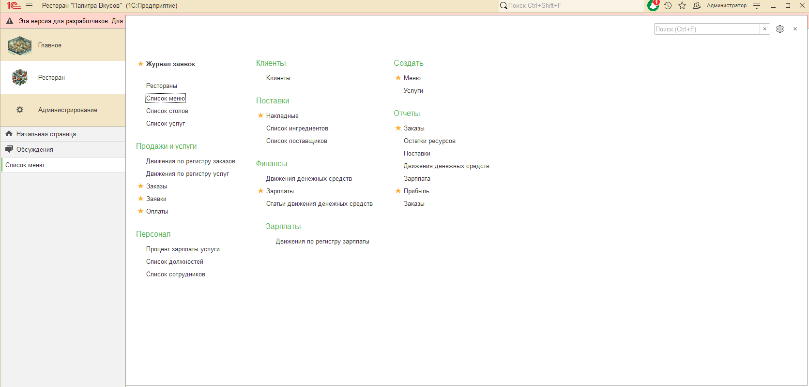
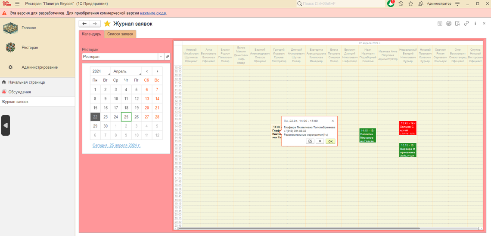
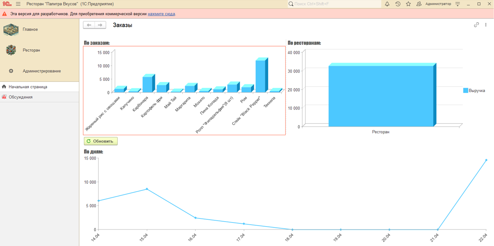
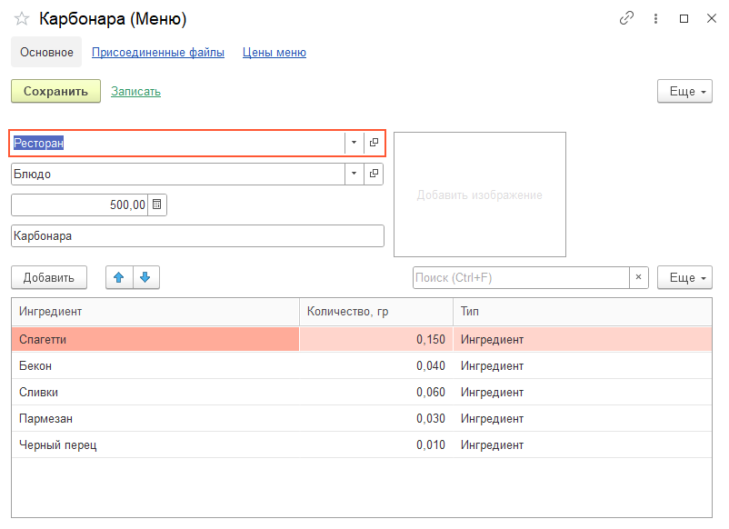
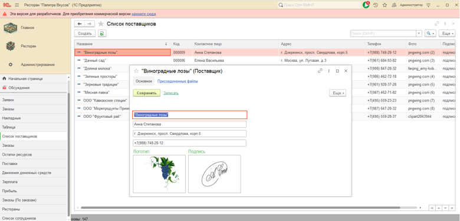
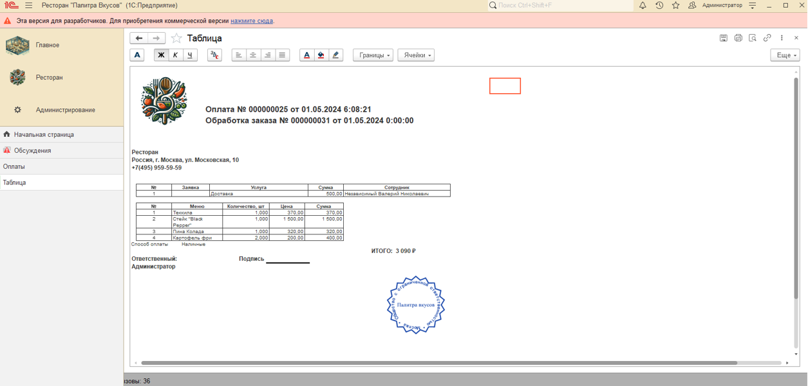
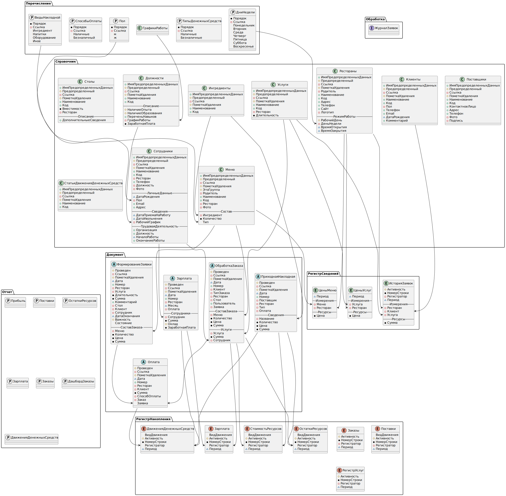

# 🍽️ Конфигурация "Ресторан"

## 📖 Описание проекта
Самописная конфигурация для автоматизации процессов ресторана.  
Реализован полный цикл обслуживания клиентов: от оформления заказов до расчёта ингредиентов и формирования отчетов.  

Проект демонстрирует навыки:
- разработки управляемых форм и обработки данных;
- работы с регистрами накопления и справочниками;
- создания собственных документов и отчетов;
- проектирования структуры данных (ER-схема прилагается).

---

## ⚙️ Основной функционал

### 🍔 Учёт заказов
- **Обработка "Журнал заказов"** — позволяет создавать, редактировать и контролировать заказы в одном окне.  
- Расчёт итоговой суммы по позициям и автоматическое формирование печатных форм.  
- Возможность пробить чек и провести оплату.

### 🧾 Учёт поставок и оплат
- Документ **"Поступление товаров"** — оформляет получение продуктов от поставщиков.  
- Документ **"Оплата"** — формирует чек, отражает оплату клиента.  
- Реализованы печатные формы и формы редактирования документов.

### 🧩 Справочники
- **Меню** — блюда, цены, категории.  
- **Рестораны** — учёт филиалов и данных о заведениях.  
- **Поставщики** — партнёры для закупки ингредиентов.  

### 📊 Отчётность и дашборды
- Дашборд заказов (**Dashboard_Orders**) — визуализация текущих заказов.  
- Планируется отчёт по продажам и статистика по блюдам. 

---

## 🧩 Технические детали

- Платформа: **1С:Предприятие 8.3**
- Тип: **самописная конфигурация**
- Версия: **1.0.1.1**
- Архитектура: документы + справочники + регистры + управляемые формы
- Язык: встроенный язык 1С
- Интерфейс: управляемый, поддерживает обработку и печать
- БСП **3.1.7.165**

---

## 🖼️ Галерея интерфейса

| Главное меню | Список заказов | Дашборд |
|---------------|----------------|----------|
|  |  |  |

| Меню (блюда) | Поставщики | Чек оплаты |
|---------------|-------------|-------------|
|  |  |  |

---

## 🧩 Код и логика

Примеры модулей и листингов:
- [Catalog_Menu_element_form_code_listing.png](listing/Catalog_Menu_element_form_code_listing.png)
- [Catalog_restaurant_manager_module_code_listing.png](listing/Catalog_restaurant_manager_module_code_listing.png)
- [Data_processor_order_list_code_listing.png](listing/Data_processor_order_list_code_listing.png)

ER-схема базы данных:  

---

## 💾 Архив конфигурации
- [restaurant1.0.1.1.dt](https://drive.google.com/file/d/1loc3FZzFMKwj379W8ecDo2tNBjiyU07d/view?usp=drive_link) — резервная копия базы.

---

## 🔗 Автор
**Ермолаев Глеб**  
GitHub: [TheFlukas](https://github.com/TheFlukas)

---