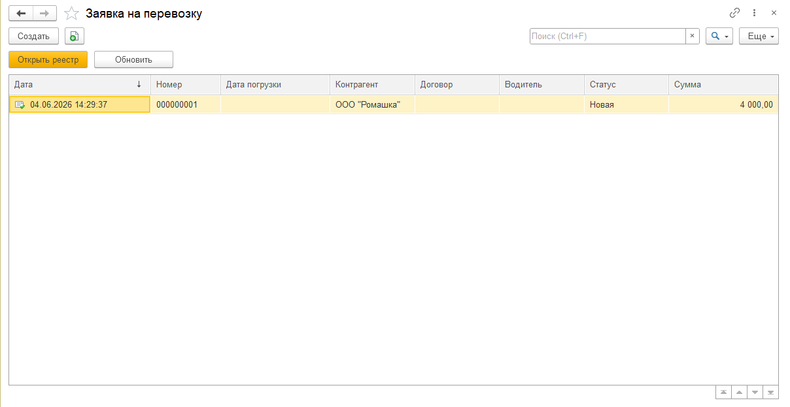
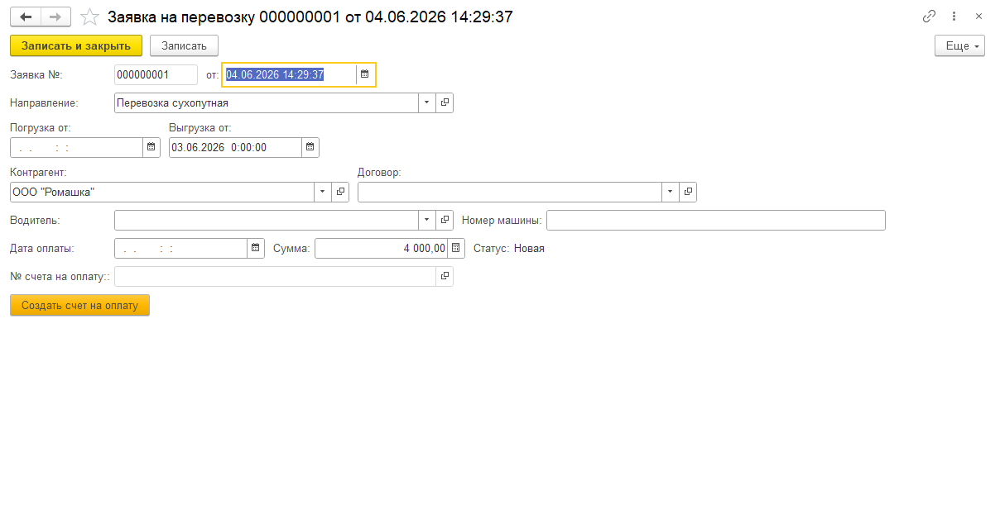
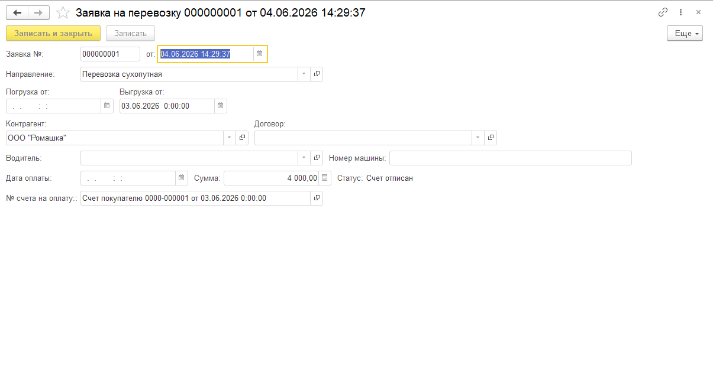
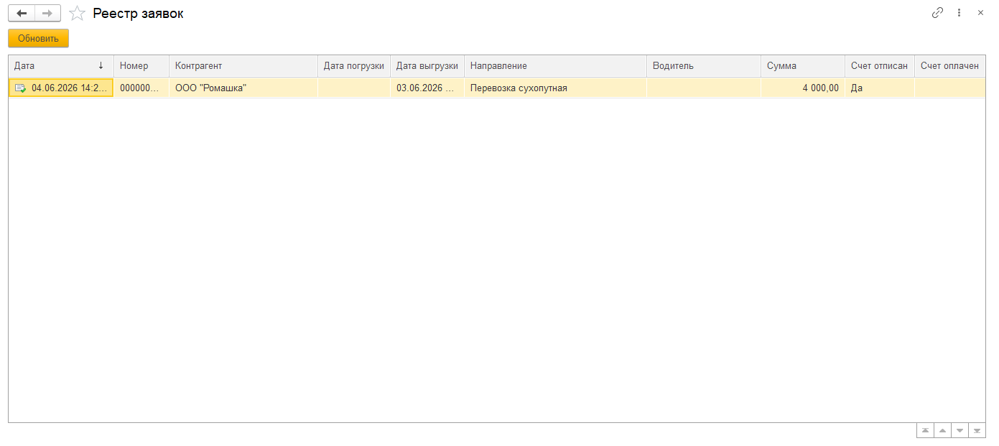
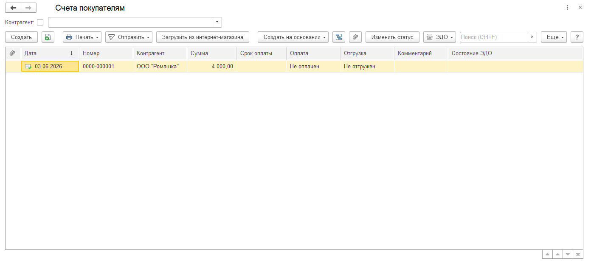
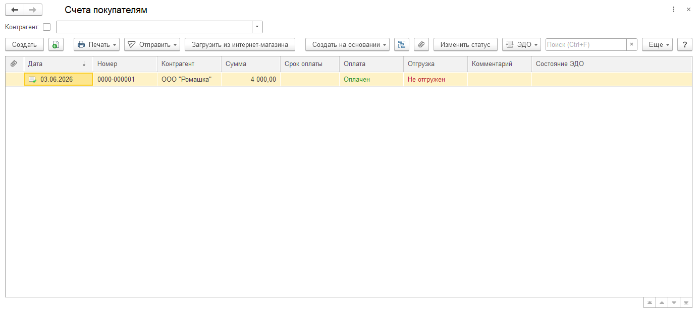

# 🚛 Учёт заявок на перевозку — Расширение для 1С:Бухгалтерия 3

Тестовое задание выполнено по заданию **ГАРАНТ**.  
Реализовано расширение для типовой конфигурации **1С:Бухгалтерия предприятия 3** (ФРЕШ-совместимое): документ «Заявка на перевозку» с автоматическим созданием счёта на оплату, управлением статусами и реестром заявок.

---

## 📑 Техническое задание

> Создать документ «Заявка» в 1С:БП 3. На основании заявки при заполненной дате выгрузки автоматически выписывать счёт на оплату. При наличии проведённого счёта — заявка переходит в статус «Счёт отписан» и блокируется от редактирования. Вывести реестр заявок с отображением статусов оплаты.

---

## 🚀 Реализованный функционал

### 1. 📄 Документ «Заявка на перевозку»
- **Дата документа**, номер
- **Дата погрузки** и **дата выгрузки** — вводятся вручную
- **Дата оплаты** — вводится вручную
- **Контрагент** — из справочника контрагентов
- **Договор** — из справочника договоров с контрагентом
- **Направление** — полное наименование из справочника номенклатуры (вид: услуга)
- **Водитель** — из справочника физических лиц
- **Номер машины** — вводится вручную
- **Сумма** — стоимость услуги, вводится вручную
- **Статус** — устанавливается автоматически
- Кнопка **«Создать счёт на оплату»** — доступна при заполненной дате выгрузки

### 2. 🧾 Автоматическое создание счёта на оплату
- Счёт создаётся на основании заявки
- **Номенклатура** — направление из заявки
- **Дата счёта** — дата выгрузки из заявки
- **Сумма** — сумма заявки
- После проведения счёта в заявке автоматически заполняется поле **«№ счёта на оплату»**

### 3. 🔄 Автоматическое управление статусами
- При создании заявки: статус **«Новая»**
- После выписки и проведения счёта: статус **«Счёт отписан»** — заявка блокируется от редактирования
- После оплаты счёта: статус обновляется автоматически, в реестре отображается **«Счёт оплачен»**

### 4. 📊 Реестр заявок
- Открывается кнопкой **«Открыть реестр»** из списка документов
- Отображает все заявки с полями:
  - Дата, Номер, Контрагент
  - Дата погрузки, Дата выгрузки
  - Направление, Водитель, Сумма
  - **Счёт отписан** (Да/—)
  - **Счёт оплачен** (Да/—)

---

## 🧭 Пример сценария использования

1. Менеджер создаёт **Заявку на перевозку**, заполняет контрагента, направление, сумму, дату выгрузки.
2. Нажимает **«Создать счёт на оплату»** — автоматически формируется счёт покупателя.
3. Счёт проводится — заявка получает статус **«Счёт отписан»** и блокируется.
4. После оплаты счёта — в реестре заявок оба флага отображаются как **«Да»**.

---

## 🖼️ Скриншоты интерфейса

| Объект | Изображение |
|--------|------------|
| Подсистема в меню |  |
| Список документов «Заявка» |  |
| Форма документа (новая) |  |
| Заявка с открытым счётом |  |
| Реестр заявок |  |
| Счёт на оплату — не оплачен |  |
| Счёт на оплату — оплачен |  |
| Автоматическая смена статусов в реестре |  |

---

## 🧱 Технические детали

- **Платформа:** 1С:Предприятие 8.3
- **Конфигурация:** Бухгалтерия предприятия 3 (ФРЕШ-совместимая)
- **Реализация:** расширение конфигурации (.cfe)
- **Архитектура:** документ + подписка на события + управляемые формы
- **Язык:** встроенный язык 1С
- Реализованы механизмы:
  - Автоматическое создание счёта на оплату на основании заявки
  - Блокировка формы при наличии проведённого счёта
  - Динамическое обновление статусов через подписки на события

---

## 💾 Архив расширения

- [`ужЗв_УчетЗаявокНаПеревозку_РАСШИРЕНИЕ.cfe`](archive_base/ужЗв_УчетЗаявокНаПеревозку_РАСШИРЕНИЕ.cfe)

---

## 🔗 Автор

**Ермолаев Глеб**  
GitHub: [TheFlukas](https://github.com/TheFlukas)
