# 📋 Тестовое задание — Решение Н

Тестовое задание выполнено по заданию **Решение Н** и включает два независимых задания:

- **Задание 1** — расширение редактированных печатных форм для **1С:Камин ЗУП**
- **Задание 2** — механизм учёта заданий субподряда для **1С:Бухгалтерия ПРОФ**

---

# 📄 Задание 1 — Редактированные печатные формы для 1С:Камин ЗУП

Разработано расширение для конфигурации **1С:Камин Зарплата и Управление Персоналом**.  
Реализованы две доработанные печатные формы: **Трудовой договор** (из документа «Приём») и **Дополнительное соглашение** (из документа «Изменения»).

---

## 🧩 Реализованный функционал

### 1. 📝 Трудовой договор редактированный (документ «Приём»)
- Кнопка **«Трудовой договор редактированный»** добавлена в меню «Печать» формы документа и в список документов
- **п.1.3** — адрес места работы берётся из реквизита «Фактический адрес» справочника «Подразделения»; при отсутствии — из фактического адреса организации
- **п.4** — к словам «должностная инструкция» автоматически добавляется наименование должности сотрудника
- **Раздел V (пп.5.1, 5.2)** — время начала и окончания работы оставлено строковым типом для ручного заполнения

### 2. 📝 Дополнительное соглашение редактированное (документ «Изменения»)
- Кнопка **«Доп. соглашение к договору редактированное»** добавлена в меню «Печать» формы и списка документов
- **Номер соглашения** — берётся из реквизита «НомерСоглашения» (поле «Основание: номер»)
- **Форма выбора изменений** — перед печатью открывается список разделов с флажками, позволяющий выбрать, какие пункты включать в соглашение
- Текст пунктов формируется **динамически** в зависимости от изменений в документе:

| Изменение в документе | Пункт соглашения |
|---|---|
| Должность / Подразделение | п.1.1 — место работы |
| Статус работы | п.1.3 |
| Срок договора | п.1.6 |
| Табель (график работы) | п.3.2 |
| Ставка / Оклад | пп.6.2 п.6 — оплата |
| Условия труда | п.6.2 — класс и дата оценки из регистра «ЗначенияКлассовУсловийТруда» |

---

## 🗂️ Структура расширения

- **Общий модуль** `УправлениеПечатьюКлиентКАМИН`
  - `ПечатьДопСоглашениеИзменения_РЕД` — вызов формы выбора и печать
  - `ПослеНастройки_РЕД` — обработка выбора пунктов
- **Модуль менеджера** документа «Приём»
  - Функция `Печать_ТДРЕД`
  - Регистрация команды «Трудовой договор редактированный»
- **Модуль менеджера** документа «Изменения»
  - Функция `Печать_ДСРЕД`
  - Процедура `ВывестиДССотрудникаРЕД`
  - Регистрация команды «Доп. соглашение редактированное»
- **Макет** `ПФ_MXL_ТрудовойДоговорРЕД`
- **Макет** `ПФ_MXL_МакетДополнительногоСоглашенияРЕД`

> Расширение содержит технический модуль обхода защиты типовой конфигурации (не авторская разработка).

---

## 🖼️ Скриншоты (Задание 1)

| Объект | Изображение |
|--------|------------|
| Изменённые объекты расширения | 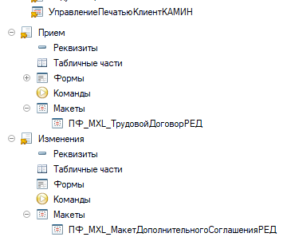 |
| Кнопка печати в форме документа «Приём» | 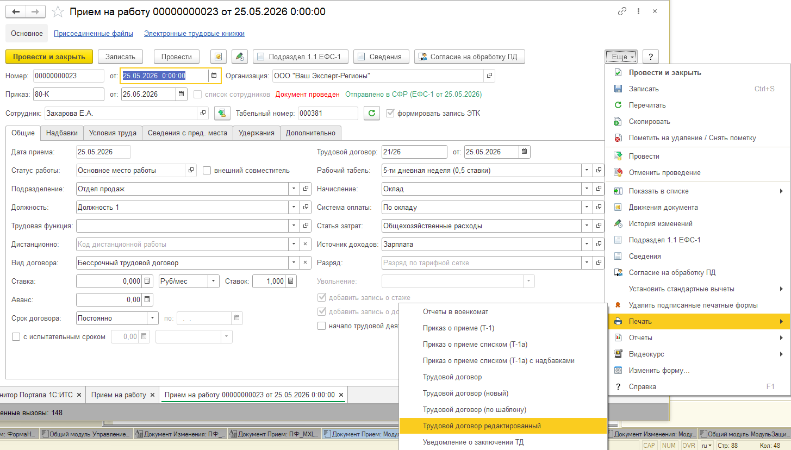 |
| Кнопка печати в списке документов «Приём» | 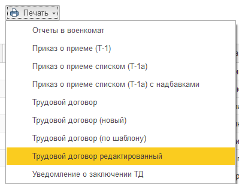 |
| Результат печатной формы трудового договора | 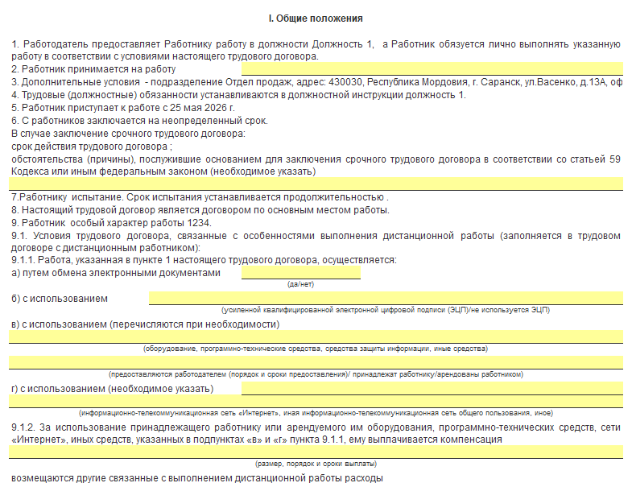 |
| Заполнение пп.5.1–5.2 строкой | 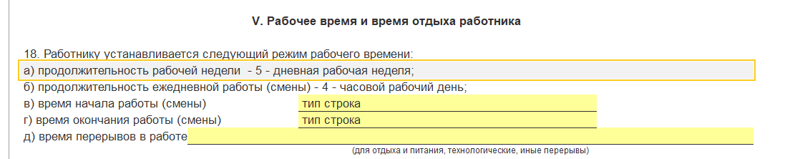 |
| Кнопка печати в форме документа «Изменения» | 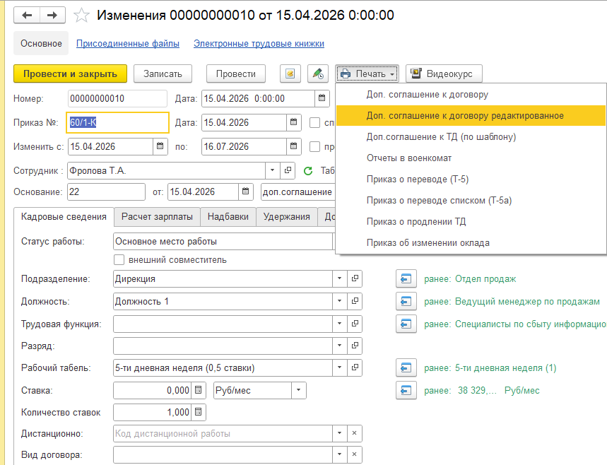 |
| Кнопка печати в списке документа «Изменения» | 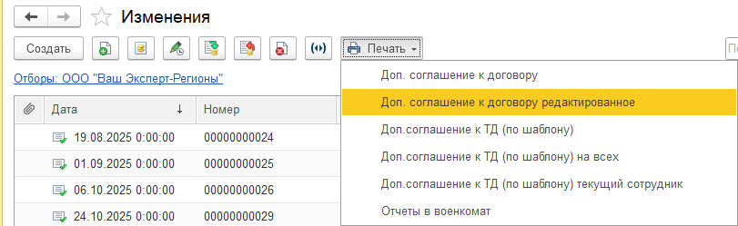 |
| Форма выбора изменений для доп. соглашения | 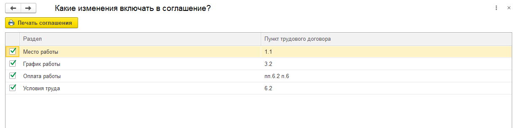 |
| Результат формирования доп. соглашения | 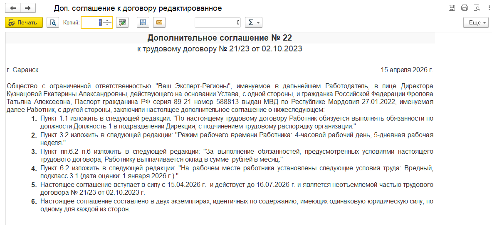 |

---

## 🧱 Технические детали (Задание 1)

- **Платформа:** 1С:Предприятие 8.3
- **Конфигурация:** 1С:Камин Зарплата и Управление Персоналом
- **Реализация:** расширение конфигурации (.cfe)
- **Язык:** встроенный язык 1С
- Реализованы механизмы:
  - Динамическое формирование текста пунктов доп. соглашения
  - Получение класса условий труда из регистра сведений по должности
  - Получение фактического адреса из справочника подразделений

---

## 💾 Архив расширения (Задание 1)

- [`ПФ_РЕД_КАМИН_РАСШИРЕНИЕ.cfe`](archive_base/ПФ_РЕД_КАМИН_РАСШИРЕНИЕ.cfe)

---

---

# 📦 Задание 2 — Учёт заданий субподряда для 1С:Бухгалтерия ПРОФ

Разработан полноценный механизм для ввода, хранения и анализа данных о клиентских задачах, переданных на субподряд. Включает документ с несколькими табличными частями, регистры накопления, присоединённые файлы и отчёт с расчётом маржи.

> ⚠️ Расширение требует версию платформы не ниже **8.3.17**. Тестировалось на базе 8.3.20 (БП 03.197.22).

---

## 🧩 Реализованный функционал

### 1. 📄 Документ «УЗС_ЗаданиеСубподряд»

**Шапка документа:**
- Клиент, Договор клиента
- Согласованная сумма
- Период выполнения (с / по)
- Описание (произвольный текст)
- Статус, Файл

**Табличные части:**

| Табличная часть | Документ-источник | Поля |
|---|---|---|
| Отгрузки клиенту | РеализацияТоваровУслуг | Документ, Сумма, Сумма по заданию, Комментарий |
| Оплаты клиента | ПоступлениеНаРасчётныйСчёт | Документ, Сумма, Сумма по заданию, Комментарий |
| Поступления услуг субподряда | ПоступлениеТоваровУслуг | Субподрядчик, Документ, Сумма, Сумма по заданию, Комментарий |
| Оплаты субподрядчикам | СписаниеСРасчётногоСчёта | Субподрядчик, Документ, Сумма, Сумма по заданию, Комментарий |

- **Частичные оплаты/отгрузки** — реализованы через два поля: «Сумма» (полная сумма документа) и «Сумма по заданию» (часть, относящаяся к данному заданию)
- **Присоединённые файлы** — через типовой механизм 1С и справочник `УЗС_ЗаданиеСубподрядПрисоединённыеФайлы`

### 2. 🗂️ Регистры накопления (оборотные)

- `УЗС_РасчётыПоЗаданиям` — Измерения: Задание, Клиент, ВидОперации; Ресурс: Сумма
- `УЗС_РасчётыПоЗаданиямСубподряд` — Измерения: Задание, Субподрядчик, ВидОперации; Ресурс: Сумма

**Перечисления:**
- `УЗС_ВидыОперацийПоЗаданиям` — Отгрузка, Оплата
- `УЗС_ВидыОперацийПоЗаданиямСубподряд` — Поступление, Оплата

### 3. 📊 Отчёт «УЗС_ЗаданияСубподряд»

- **Параметры:** период, клиент (множественный выбор), субподрядчик
- **Переключатель:** «По отгрузке / По оплате»
- **Группировки:** Клиент → Задание → Субподрядчик → Вид операции → Документ
- **Колонки:** согласованная сумма, сумма отгрузки, сумма оплаты, задолженность (расчёт), остаток работ, затраты субподряда, маржа

> Примечание: в образце субподрядчики расположены горизонтально колонками. В СКД динамическое количество колонок стандартными средствами не реализуемо, поэтому субподрядчики выведены строками с группировкой — все данные сохранены в полном объёме.

---

## 🖼️ Скриншоты (Задание 2)

| Объект | Изображение |
|--------|------------|
| Образец отчёта из ТЗ | 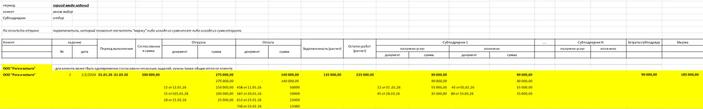 |
| Структура расширения | 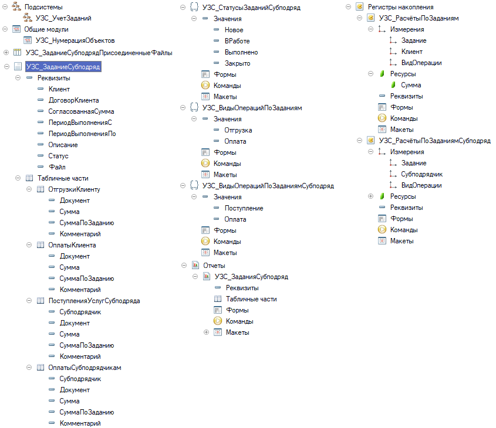 |
| Список заданий субподряд | 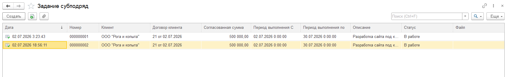 |
| Форма документа | 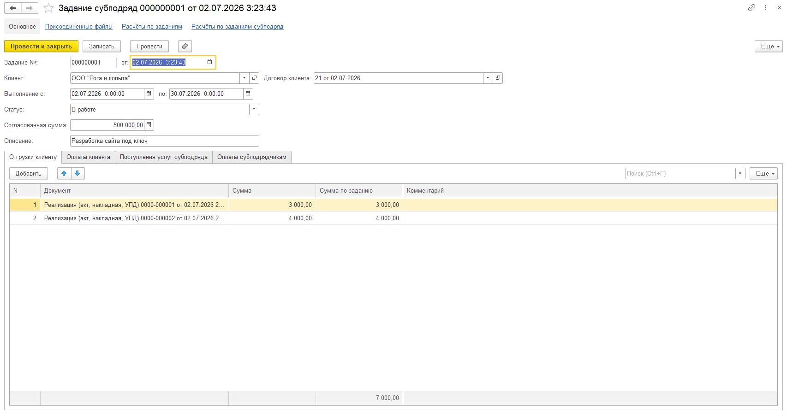 |
| Присоединённые файлы | 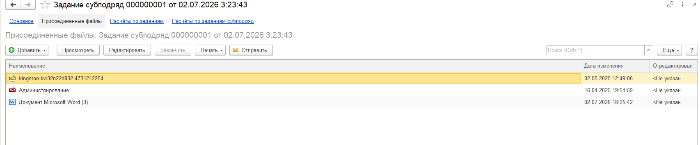 |
| Отчёт — маржа по отгрузке | 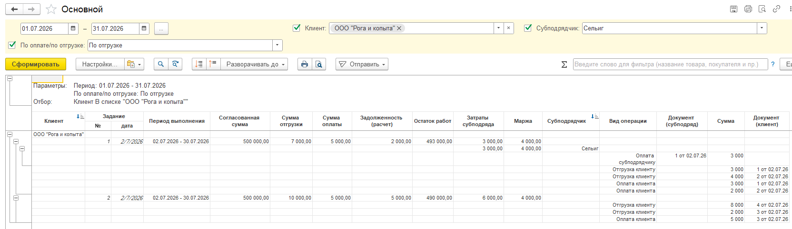 |
| Отчёт — маржа по оплате | 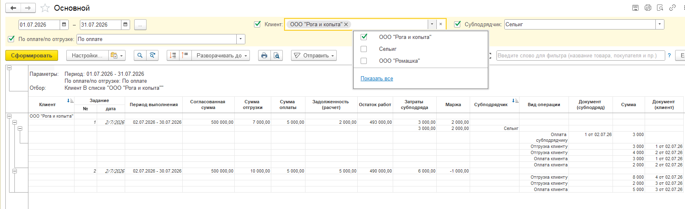 |

---

## 🧱 Технические детали (Задание 2)

- **Платформа:** 1С:Предприятие 8.3.17+
- **Конфигурация:** Бухгалтерия предприятия ПРОФ (тестировалось на БП 03.197.22, платформа 8.3.20)
- **Реализация:** расширение конфигурации (.cfe)
- **Язык:** встроенный язык 1С, СКД
- Реализованы механизмы:
  - Учёт частичных оплат и отгрузок через два поля суммы
  - Движения по двум оборотным регистрам при проведении документа
  - Отчёт СКД с переключателем «По отгрузке / По оплате»

---

## 💾 Архив расширения (Задание 2)

- [`УчётЗаданийСубподряд_БП_РАСШИРЕНИЕ.cfe`](archive_base/УчётЗаданийСубподряд_БП_РАСШИРЕНИЕ.cfe)

---

## 🔗 Автор

**Ермолаев Глеб**  
GitHub: [TheFlukas](https://github.com/TheFlukas)
