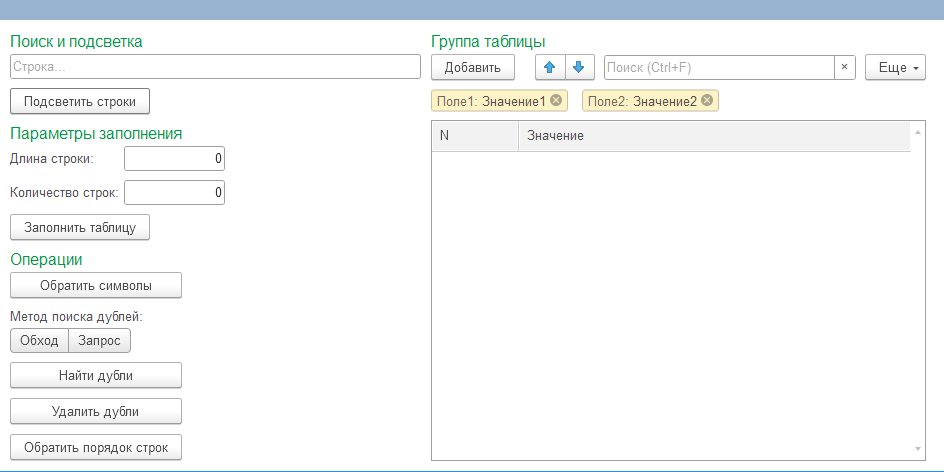

# 🔧 Внешняя обработка — Работа с таблицей значений

Тестовое задание выполнено по заданию **РС Консалт**.  
Реализована внешняя обработка на платформе **1С:Предприятие 8.3** с табличной частью, поиском и подсветкой строк, поиском и удалением дублей двумя методами (обход + запрос), обратным отражением строк и символов.

---

## 📑 Техническое задание

> Создать обработку с табличной частью. Количество строк и длина строки задаются на форме. Реализовать: подсветку строк, реверс порядка строк, реверс символов в строках, поиск дублей (двумя методами — обход и запрос, с замером времени), удаление дублей.

---

## 🚀 Реализованный функционал

### 1. 📋 Заполнение таблицы
- Задаётся **длина строки** (количество символов) и **количество строк**
- Таблица заполняется случайными строками через кнопку **«Заполнить таблицу»**

### 2. 🔍 Поиск и подсветка строк
- В отдельном поле вводится искомая комбинация символов
- Кнопка **«Подсветить строки»** выделяет строки, содержащие заданный текст

### 3. 🔃 Обратный порядок строк
- Кнопка **«Обратить порядок строк»** сортирует строки таблицы в обратном порядке

### 4. 🔡 Реверс символов в строках
- Кнопка **«Обратить символы»** разворачивает каждую строку посимвольно  
  Пример: `eab790` → `097bae`

### 5. 🔎 Поиск дублей — два метода
- **Метод «Обход»** — перебор строк в цикле
- **Метод «Запрос»** — поиск через SQL-запрос к таблице значений
- По каждому методу выводится **время выполнения в секундах**
- Результат: сообщение вида  
  `Значение eab790 в строке 1023 дублируется в строках 2000, 6740`

### 6. 🗑️ Удаление дублей
- Кнопка **«Удалить дубли»** оставляет только первое вхождение каждого значения, удаляя повторы, расположенные ближе к концу таблицы

---

## 🖼️ Скриншоты интерфейса

- 

---

## 🧱 Технические детали

- **Платформа:** 1С:Предприятие 8.3
- **Тип:** внешняя обработка (.epf)
- **Интерфейс:** управляемые формы
- **Язык:** встроенный язык 1С
- Поиск дублей реализован двумя методами: **циклический обход** и **запрос к таблице значений**
- Замер времени: `ТекущаяУниверсальнаяДатаВМиллисекундах()`

---

## 💾 Файл обработки

- [`[Ермолаев Глеб][01.06.2026].epf`](archive_base/%5BЕрмолаев%20Глеб%5D%5B01.06.2026%5D.epf)

---

## 🔗 Автор

**Ермолаев Глеб**  
GitHub: [TheFlukas](https://github.com/TheFlukas)
