# ⚙️ Учет сопутствующих товаров для оборудования

---

## 📑 Техническое задание

Документ, по которому выполнен проект:  
- [Техническое задание (TZ_middle.docx)](docs/TZ_middle.docx)

> В документе описано исходное тестовое задание, требования к функциональности, документы, регистры и алгоритмы работы.

---

## 📘 Описание

Тестовое задание реализовано на типовой конфигурации **1С:Управление торговлей 11** (актуальная версия).  
Задача — автоматизировать **учет сопутствующих товаров / комплектующих / запасных частей**, привязанных к сериям оборудования.  

Каждая единица оборудования имеет собственную серию, к которой закрепляются сопутствующие товары.  
Система автоматически учитывает движение этих товаров при поступлении, перемещении, реализации и корректировке состава.

---

## 🧩 Реализованный функционал

### 1. 📄 Документ **Приобретение товаров и услуг**
- Для строк оборудования указывается **серия**.
- Добавлена **команда выбора сопутствующих товаров**.
- В отдельной форме можно указать номенклатуру и количество сопутствующих товаров **на единицу оборудования**.
- При проведении данные записываются в информационный регистр.

---

### 2. 🧾 Документ **Корректировка сопутствующих товаров для оборудования**
- Позволяет **изменить состав сопутствующих товаров** для конкретной серии оборудования.  
- Автоматически заполняется текущий состав (табличная часть «Текущий состав») и позволяет ввести новый.
- Сохраняет изменения в регистре сведений.

---

### 3. 📦 Документ **Реализация товаров и услуг**
- При списании оборудования автоматически **определяет состав сопутствующих товаров** и списывает их пропорционально количеству списанных единиц.
- Добавлена **печатная форма** для отображения списанных сопутствующих товаров:

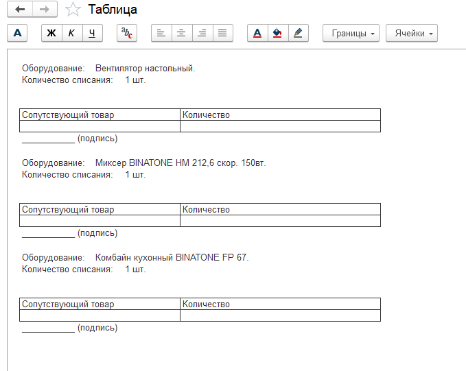

---

### 4. 🗂️ Информационный регистр **Состав сопутствующих товаров**
- Хранит связи между сериями оборудования и их сопутствующими позициями.
- Изменения фиксируются документами **Приобретение товаров и услуг** и **Корректировка сопутствующих товаров для оборудования**.

---

### 5. 📊 Внешний отчет **Ведомость по сопутствующим товарам**
- Позволяет анализировать движение сопутствующих товаров.
- Поля отчета:
- Номенклатура оборудования  
- Серия оборудования  
- Сопутствующий товар  
- Начальный остаток  
- Приход  
- Расход  
- Конечный остаток  
- Реализована расшифровка по документам-регистраторам (без детализации по дням).

---

## 🧱 Технические детали

- **Платформа:** 1С:Предприятие 8.3  
- **Конфигурация:** Управление торговлей 11.5.11.70 (типовая)  
- **Реализация:** через расширение конфигурации и внешний отчет  
- **Архитектура:** документы + регистры сведений + регистры накопления + формы  
- **Язык:** встроенный язык 1С  

---

## 🧭 Пример сценария использования

1. **Поступление оборудования** — документ *Приобретение товаров и услуг* с указанием серии.  
2. **Добавление сопутствующих товаров** — через кнопку “Указать сопутствующие товары” в форме документа.  
3. **Корректировка состава** — при необходимости в документе *Корректировка сопутствующих товаров для оборудования*.  
4. **Реализация** — при продаже оборудования сопутствующие товары списываются автоматически.  
5. **Анализ движения** — внешний отчет *Ведомость по сопутствующим товарам* показывает приходы, расходы и остатки.

---

## 🖼️ Скриншоты

| Объект | Изображение |
|--------|--------------|
| Регистры и движение |  |
| Документ "Корректировка сопутствующих товаров" | 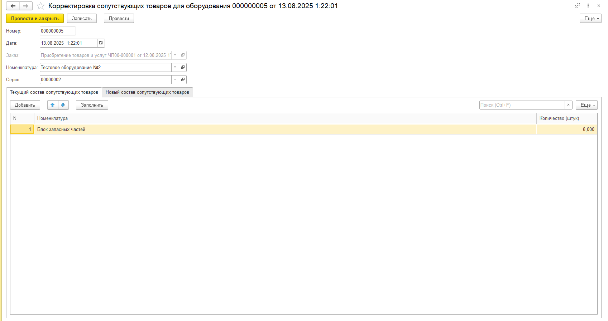 |
| Документ "Приобретение товаров" | 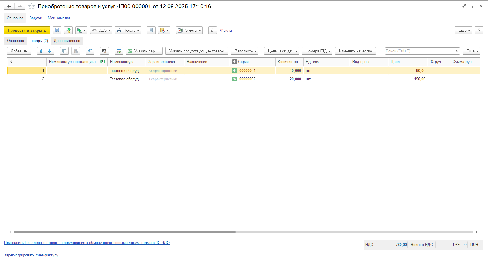 |
| Реализация и печать сопутствующих товаров |  |
| Ведомость по сопутствующим товарам | 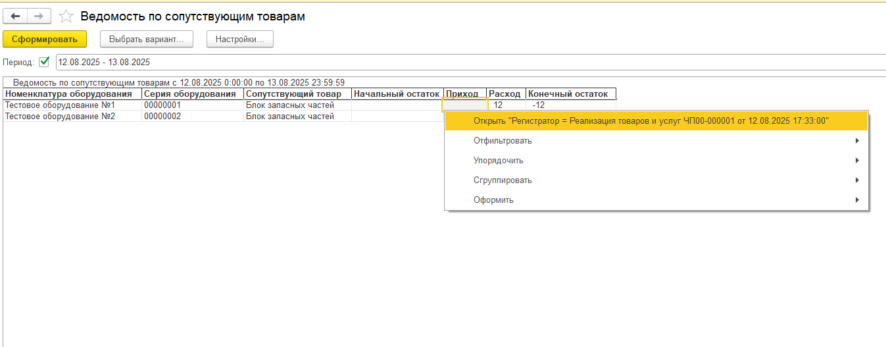 |
| Регистры сведений | 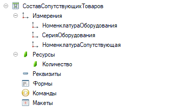 |
| Движение сопутствующих товаров | 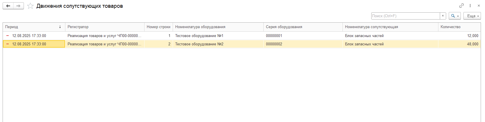 |

---

## 🧾 Листинги кода

- 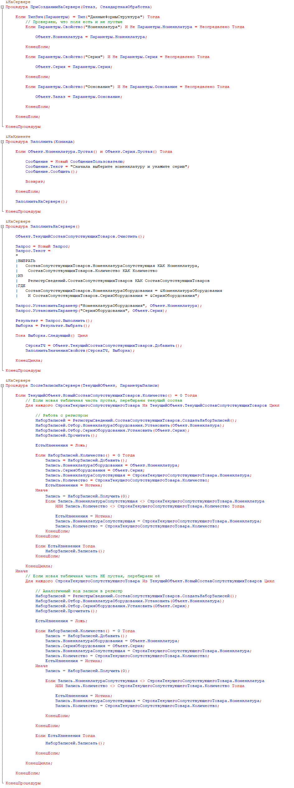
- 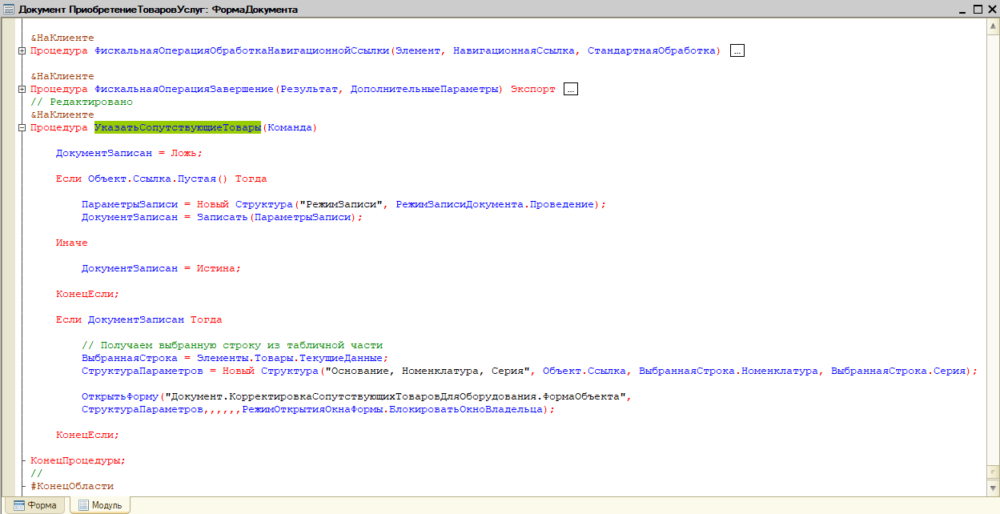
- 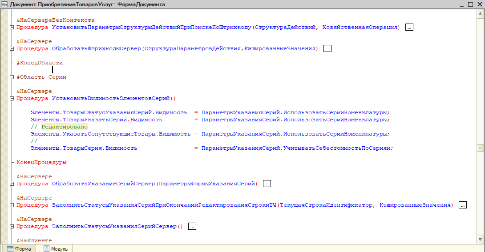
- 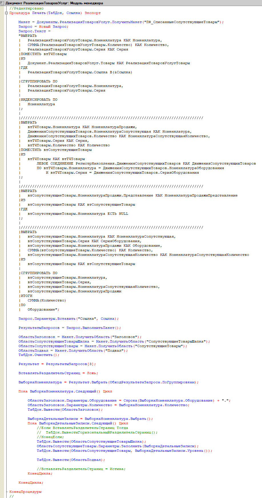
- 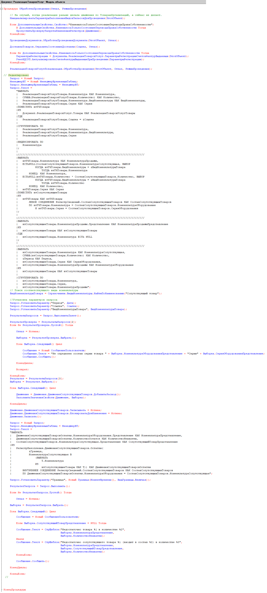   

---

## 💾 Архив конфигурации
- [ВедомостьПоСопутствующимТоварам.erf](archive_base/Statement_of_related_goods.erf)
- [УТ11.5.11.70.dt](https://drive.google.com/file/d/1mBSautR3pTfcJy6Juqw-pyfDSafoyrpx/view?usp=drive_link) — резервная копия базы

---

## 🔗 Автор
**Ермолаев Глеб**  
GitHub: [TheFlukas](https://github.com/TheFlukas)

---
